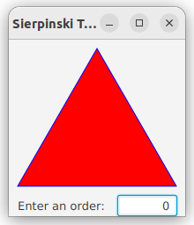
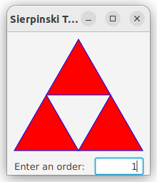
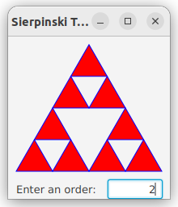
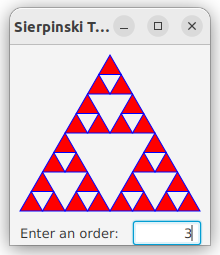
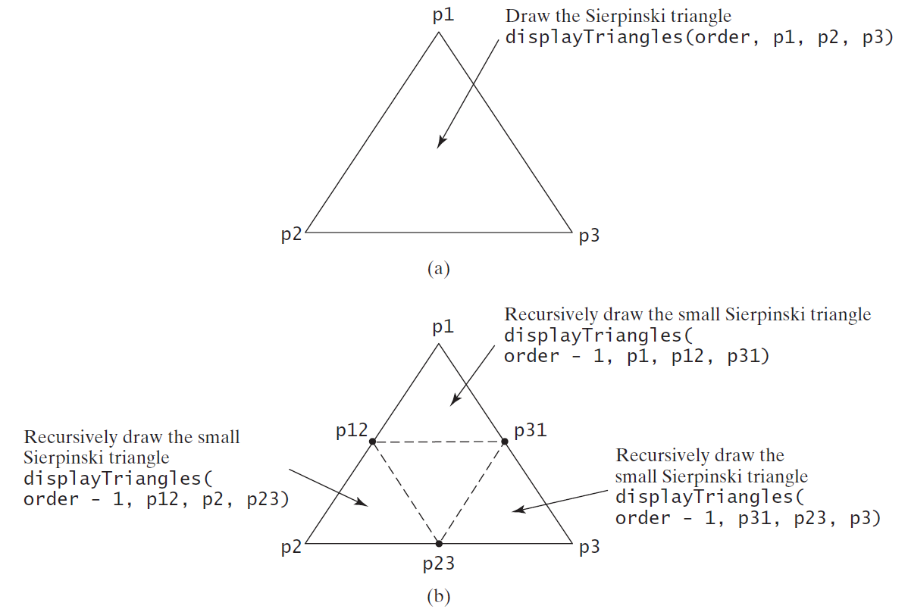

# Recursions
Chapter 18


Motivations
---
- Find the total size of all files in a directory
  - Find all files satisfy a criteria in a folder
  - process the directory *recursively*
- Generate [fractal figures](https://en.wikipedia.org/wiki/Fractal)
  - generate *recursively*

| name |  figure (from Wikipedia) |
| ---- |  ------ |
| fractal canopy |  |
| Mandelbrot set |  |


Objectives
---
- Explain recursive methods and their benefits
  - divide-and-conquer
  - implemented in a call stack
  - derive a recursive method using helper methods
- Solve problems using recursion
  - recursive mathematical functions
  - selection sort
  - binary search
  - directory size
  - Tower of Hanoi
  - draw fractals
- Convert between recursion and iteration
  - tail-recursion


Recursive mathematical functions
---

| function | recursion | base cases |
| --- | --- | --- |
| factorial | $n! = n\times (n-1)!, n>0$ | $0!=1$ |
| sum | $f(n)=n+f(n-1), n\ge 1$  | $f(0)=0$ |
| Fibonacci numbers| $f(n) = f(n-1) + f(n-2), n\ge2$ | $f(1)=1, f(0)=0$ |


Solve recursive problems
---
- divide-and-conquer
  - break the problem into similar subproblems with smaller size
- Characteristics of Recursion
  - implemented using a conditional statement that leads to different cases
  - One or more base cases (the simplest cases) are used to stop
  - Every recursive call reduces the original problem increasingly closer to until becomes base cases

```java
import java.util.Scanner;

public class RecFuns {
  public static void main(String[] args) {
    Scanner input = new Scanner(System.in);
    System.out.print("Enter an integer: ");
    int n = input.nextInt();

    long fac = factorial(n);
    long sum = sum0ton(n);
    long fib = fibonacci(n);

    System.out.printf("factorial(%d)=%d\nsum1ton(%d)=%d\nfibonacci(%d)=%d\n",
        n, fac, n, sum, n, fib);
  }

  public static long factorial(int n) {
    if (n == 0)
      return 1;
    else
      return n * factorial(n - 1);
  }

  public static long sum0ton(int n) {
    if (n == 0) {
      return 0;
    } else {
      return n + sum0ton(n - 1);
    }
  }

  public static long fibonacci(int n) {
    if (n == 0) {
      return 0;
    } else if (n == 1) {
      return 1;
    } else {
      return fibonacci(n - 1) + fibonacci(n - 2);
    }
  }
}
```

Practice 📝
---
- run the code above
  - show call stacks of the three recursive methods
  - show call stacks on paper
- write recursive methods
  - print a message $n$ times
  - determine whether a string is a palindrome
  - [reference implementation](./demos/RecProbs.java)


Recursive Helper Methods
---
- recursive callee methods
- the inputs and the outputs of the problem are handled with caller methods

```java
public static boolean isPalindrome(String s){
  return isPalindrome(s, 0, s.length()-1);
}

public static boolean isPalindrome(String s, int low, int high){
  if (high <= low) {
    return true;
  } else if(s.charAt(low) != s.charAt(high)) {
    return false;
  } else {
    return isPalindrome(s, low+1, high-1);
  }
}
```


Recursive Selection Sort
---
- Find the smallest number in the list and swaps it with the first number
- Ignore the first number and sort the remaining smaller list recursively

```java
public static void sort(int[] list) {
  sort(list, 0, list.length - 1); 
}
private static void sort(int[] list, int low, int high) {
  if (low < high) {
    int indexOfMin = low;
    int min = list[low];
    for (int i = low + 1; i <= high; i++) {
      if (list[i] < min) {
        min = list[i];
        indexOfMin = i;
      }
    }

    list[indexOfMin] = list[low];
    list[low] = min;

    sort(list, low + 1, high);
  }
} 
```


Recursive Binary Search
---
- Case 1: If the key is equal to the middle element, the search ends with a match
- Case 2: If the key is less than the middle element, recursively search the key in the first half of the array
- Case 3: If the key is greater than the middle element, recursively search the key in the second half of the array

```java
public static int bsearch(int[] list, int key) {
  int low = 0;
  int high = list.length - 1;
  return bsearch(list, key, low, high);
}

public static int bsearch(int[] list, int key, int low, int high) {
  if (low > high) { // exhausted without a match
    return -low - 1;
  }

  int mid = (low + high) / 2;
  if (list[mid] == key) {
    return mid;
  } else if (key < list[mid]) {
    return bsearch(list, key, low, mid - 1);
  } else {
    return bsearch(list, key, mid + 1, high);
  }
}
```


Directory Size
---
- the sum of the sizes of all files in the directory $p$ (path)
- directory $p$ may contain files $f$ and subdirectories $d$
- defined recursively as

$$size(p)=\sum_{f \in p}f + \sum_{d \in p}size(d)$$

```java
public static long directorySize(File p){
  long size = 0;

  if (p.isDirectory()) {
    File[] fs = p.listFiles();
    for (File file : fs) {
      if(file != null)
        size += directorySize(file);
    }
  } else {
    size += p.length();
  }

  return size;
}
```


[Tower of Hanoi](https://en.wikipedia.org/wiki/Tower_of_Hanoi)
---
- There are n disks labeled 1, 2, 3, . . ., n, and three towers labeled A, B, and C
- No disk can be on top of a smaller disk at any time
- All the disks are initially placed on tower A
- Only one disk can be moved at a time, and it must be the top disk on the tower
- **Question**: how to move all disks to tower C in minimum number of steps?
- **Solution**: 
  - Move the first n - 1 disks from A to C with the assistance of tower B
  - Move disk n from A to B
  - Move n - 1 disks from C to B with the assistance of tower A

```java
public static void Hanoi(int n, char from, char via, char to) {
  if (n == 1) {
    System.out.printf("Move disk %d from %c to %c\n", n, from, to);
  } else {
    Hanoi(n - 1, from, to, via);
    System.out.printf("Move disk %d from %c to %c\n", n, from, to);
    Hanoi(n - 1, via, from, to);
  }
}
```

Greatest Common Divisor (GCD)
---
- examples
  - gcd(3,7) = 1
  - gcd(5,10) = 5
- solutions
  - Approach 1: Brute-force, start from min(n, m) down to 1, to check if a number is common divisor for both m and n, if so, it is the greatest common divisor
  - Approach 2: [Euclid’s algorithm](https://en.wikipedia.org/wiki/Euclidean_algorithm)
  - Approach 3: Recursive method


Approach 2: [Euclid’s algorithm](https://en.wikipedia.org/wiki/Euclidean_algorithm)
---
```java
public static long Euclid(long m, long n) {
  if (n == 0) {
    return m;
  }

  long am = Math.abs(m);
  long an = Math.abs(n);

  long r = am % an;
  while (r != 0) {
    am = an;
    an = r;
    r = am % an;
  }
  return an;
}
```


Approach 3: Recursive Method
---
```java
public static long gcd(long m, long n) {
  if (n == 0)
    return m;
  else if (m % n == 0) {
    return n;
  } else {
    return gcd(n, m % n);
  }
}
```


Fractals
---
- can be divided into parts
  - each part is a reduced-size copy of the whole
- examples
  - [Mandelbrot set](https://en.wikipedia.org/wiki/Mandelbrot_set)
  - [Sierpinski triangle](https://en.wikipedia.org/wiki/Sierpi%C5%84ski_triangle)
  - [H tree](https://en.wikipedia.org/wiki/H_tree)


[Sierpinski triangle](https://en.wikipedia.org/wiki/Sierpi%C5%84ski_triangle)
---
- begin with an equilateral triangle
  - considered to be the Sierpinski fractal of order (or level) 0
- Connect the midpoints of the sides of the triangle of order 0 to create a Sierpinski triangle of order 1
- Leave the center triangle intact
  - Connect the midpoints of the sides of the three other triangles to create a Sierpinski of order 2
- repeat the same process recursively to create a Sierpinski triangle of order 3, 4, ..., and so on

| order | 0 | 1 | 2 | 3 |
| -- | -- | -- | -- | -- |
| Sierpinski triangle |  |  |  |  | 


Sierpinski Triangle Solution
---



- [source code](./demos/SierpinskiTriangle.java)


Recursion vs. Iteration
---
- Recursion is essentially repetition without a loop
- Recursion bears substantial overhead
  - the system must assign space for all of the recursive method’s local variables and parameters its called each time
  - consume considerable memory and require extra time to manage the additional space
- Recursion is good for solving inherently recursive problems 
- tail recursion has no pending operations to be performed on return from a recursive call
  - converted into iteration automatically by the compiler

```java
  public static BigInteger factorial(long n){
    return factorial(n, BigInteger.valueOf(1));
  }
  // tail recursive
  public static BigInteger factorial(long n, BigInteger result){
    // result is the productive accumulator
    if (n == 0) {
      return result;
    } else {
      return factorial(n-1, BigInteger.valueOf(n).multiply(result));
    }
  }
```

# References
- [Visual Studio Code show call hierarchy](https://stackoverflow.com/questions/49197137/visual-studio-code-show-call-hierarchy)
- [Liang animation](https://liveexample.pearsoncmg.com/liang/animation/animation.html)