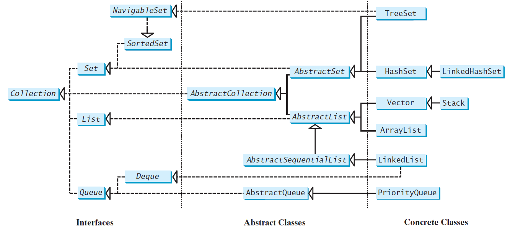
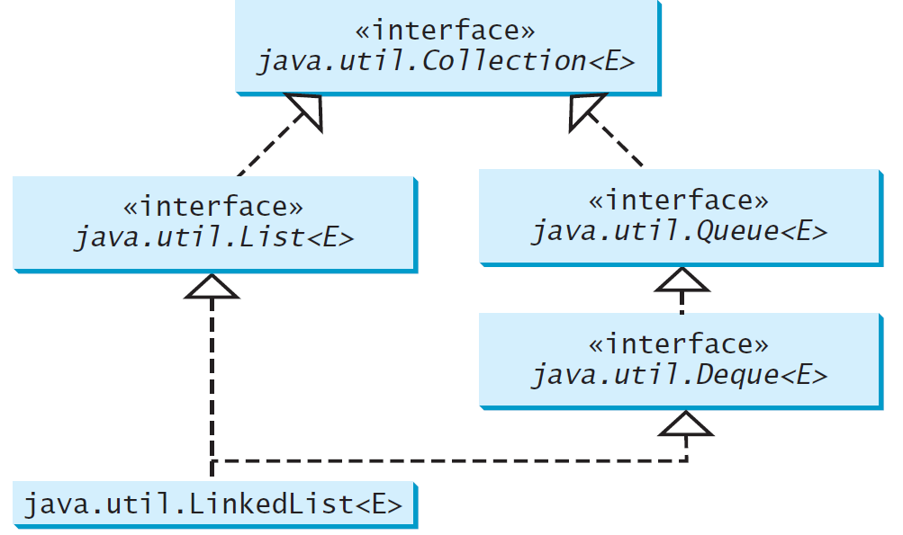

# Lists, Stacks, Queues, and Priority Queues
Chapter 20


Objectives
---
- Explore Java Collections Framework 
  - interfaces 
    - Iterator 
      - traverses the elements in a collection
    - Comparable and Comparator
      - compare elements
  - classes
    - Collection, Queue, LinkedList, and PriorityQueue
  - common methods
    - forEach 
      - performs an action on each element in a collection
    - foreach loop
      - traverses the elements in a collection
    - static utility methods
      - sorting, searching, shuffling lists, and finding the largest and smallest element in collections
- Applications
  - use ArrayList or LinkedList to store a list of elements
    - develop a multiple bouncing balls application using ArrayList
  - distinguish between Vector and ArrayList and to use the Stack class for creating stacks
    - use stacks to write a program to evaluate expressions


What is Data Structure?
---
- data organization
  - stores data 
  - supports operations for accessing and manipulating the data


Java Collection Framework hierarchy
---
- A collection is a container object that holds a group of objects, or elements

- two types of collections
  - collection,  stores a group of elements
    - Set and List are subinterfaces of Collection
  - map, stores key/value pairs




Collection Interface and class
---
- [Interface Collection\<E\>](https://devdocs.io/openjdk~11/java.base/java/util/collection)
  - manipulates a collection of objects
  - Collection -> Interable <- Iterator
  - an iterator object is obtained for traversing elements in the collection
- [Class Collections](https://devdocs.io/openjdk~11/java.base/java/util/collections)

- Methods defined in interface Collection 

| method | usage |
| --- | --- |
| isEmpty(): boolean | Returns true if this collection contains no elements |
| size(): int | Returns the number of elements in this collection |
| contains(o: Object): boolean | Returns true if this collection contains the element o |
| containsAll(c: Collection<?>):boolean | Returns true if this collection contains all the elements in c |
| add(e: E): boolean | Adds a new element e to this collection |
| remove(o: Object): boolean | Removes the element o from this collection |
| addAll(c: Collection<? extends E>): boolean | Adds all the elements in the collection c to this collection |
| removeAll(c: Collection<?>): boolean | Removes all the elements in c from this collection |
| retainAll(c: Collection<?>): boolean | Retains the elements that are both in c and in this collection |
| clear(): void | Removes all the elements from this collection |
| toArray(): Object[] | Returns an array of Object for the elements in this collection |
| toArray(a: T[]): T[] | Returns an array of the T[] type |
| stream(): Stream default | Returns a stream from this collection |
| parallelStream(): default Stream | Returns a parallel stream from this collection |

- Methods defined in interface Iterable

| method | usage |
| --- | --- |
| iterator(): Iterator\<E\> | Returns an iterator for the elements in this collection |
| forEach(action: Consumer<? super E>): default void | Performs an action for each element in this iterator |

- Methods define in interface Iterator

| method | usage |
| --- | --- |
| hasNext(): boolean | Returns true if this iterator has more elements to traverse |
| next(): E | Returns the next element from this iterator |
| remove(): void | Removes the last element obtained using the next method |


```java
import java.util.*;

public class TestCollection {
  public static void main(String[] args) {
    ArrayList<String> collection1 = new ArrayList<>();
    collection1.add("New York"); 
    collection1.add("Atlanta"); 
    collection1.add("Dallas"); 
    collection1.add("Madison"); 

    System.out.println("A list of cities in collection1:");
    System.out.println(collection1);

    System.out.println("\nIs Dallas in collection1? "
      + collection1.contains("Dallas"));

    collection1.remove("Dallas");
    System.out.println("\n" + collection1.size() + 
       " cities are in collection1 now");

    Collection<String> collection2 = new ArrayList<>();
    collection2.add("Seattle"); 
    collection2.add("Portland"); 
    collection2.add("Los Angles"); 
    collection2.add("Atlanta"); 

    System.out.println("\nA list of cities in collection2:");
    System.out.println(collection2);

    ArrayList<String> c1 = (ArrayList<String>)(collection1.clone());
    c1.addAll(collection2);
    System.out.println("\nCities in collection1 or collection2: ");
    System.out.println(c1);

    c1 = (ArrayList<String>)(collection1.clone());
    c1.retainAll(collection2);
    System.out.print("\nCities in collection1 and collection2: ");
    System.out.println(c1);

    c1 = (ArrayList<String>)(collection1.clone());
    c1.removeAll(collection2);
    System.out.print("\nCities in collection1, but not in 2: ");
    System.out.println(c1);
  }
}
```

Traverse a collection
---
- popular ways: iterator, forEach method and foreach loop
- Iterator is a classic design pattern
  - walks through a data structure 
  - without exposing the details of how data is stored in the data structure
- the forEach method in the Iterable interface functions like a foreach loop

```java
import java.util.*;

public class Traverse {
  public static void main(String[] args) {
    Collection<String> collection = new ArrayList<>();
    collection.add("New York"); 
    collection.add("Atlanta"); 
    collection.add("Dallas"); 

    // 1. Test iterator
    // var is used to specify a type can be derived by the compiler
    var iterator = collection.iterator();
    while (iterator.hasNext()) {
      System.out.print(iterator.next().toUpperCase() + " ");
    }
    System.out.println();

    // 2. Test forEach methods
    collection.forEach(e->System.out.print(e.toUpperCase() + " "));
    System.out.println();

    // 3. Test foreach loop
    for (var s : collection) {
      System.out.print(s.toUpperCase() + " ");
    }
    System.out.println();
  }
}
```


The [List Interface](https://devdocs.io/openjdk~11/java.base/java/util/list)
---
- stores elements in a sequential order
- elements can be accessed and stored by index
- concrete classes
  - ArrayList and LinkedList
- methods defined in interface List

| method | usage |
| --- | --- |
| add(index: int, element: E): void | Adds a new element at the specified index |
| addAll(index: int, c: Collection<? extends E>): boolean | Adds all the elements in c to this list at the specified index |
| remove(index: int): E | Removes the element at the specified index and returns the removed element |
| get(index: int): E | Returns the element in this list at the specified index |
| set(index: int, element: E): E | Sets the element at the specified index and returns the old element |
| indexOf(element: Object): int | Returns the index of the first matching element |
| lastIndexOf(element: Object): int | Returns the index of the last matching element |
| subList(fromIndex: int, toIndex: int): List\<E\> | Returns a sublist from fromIndex to toIndex-1 |
| listIterator(): ListIterator\<E\> | Returns the list iterator for the elements in this list |
| listIterator(startIndex: int): ListIterator\<E\> | Returns the iterator for the elements from startIndex |


The [ListIterator](https://devdocs.io/openjdk~11/java.base/java/util/listiterator)
---
- extends the Iterator interface
- enables traversal of a list bidirectionally
- methods defined

| method | usage |
| --- | --- |
| hasPrevious(): boolean | Returns true if this list iterator has more elements when traversing backward |
| previous(): E | Returns the previous element in this list iterator |
| previousIndex(): int | Returns the index of the previous element |
| nextIndex(): int | Returns the index of the next element |
| add(o: E): void | Adds the specified object to the list |
| set(o: E): void | Replaces the last element returned by the previous or next method with the specified element |


ArrayList and LinkedList
---
- concrete implementations of the List interface
- grow or shrink dynamically
- ArrayList
  - random access through an index
  - efficiently insert or delete elements from the end of the list
- LinkedList
  - efficiently insert or delete elements from both sides of the list


[ArrayList](https://devdocs.io/openjdk~11/java.base/java/util/arraylist)
---
- implements List using an array
- methods

| method | usage |
| --- | --- |
| ArrayList() | Creates an empty list with the default initial capacity |
| ArrayList(initialCapacity: int) | Creates an empty list with the specified initial capacity |
| ArrayList(c: Collection<? extends E>) | Creates an array list from an existing collection |
| trimToSize(): void | Trims the capacity of this ArrayList instance to be the list’s current size |


[LinkedList](https://devdocs.io/openjdk~11/java.base/java/util/linkedlist)
---
- implements List using a linked list
- methods

| method | usage |
| --- | --- |
| LinkedList() | Creates a default empty linked list |
| LinkedList(c: Collection<? extends E>) | Creates a linked list from an existing collection |
| addFirst(element: E): void | Adds the element to the head of this list |
| addLast(element: E): void | Adds the element to the tail of this list |
| getFirst(): E | Returns the first element from this list |
| getLast(): E | Returns the last element from this list |
| removeFirst(): E | Returns and removes the first element from this list |
| removeLast(): E | Returns and removes the last element from this list |


Practice 📝
---
- Use ArrayList and LinkedList

```java
import java.util.*;

public class TestArrayAndLinkedList {
  public static void main(String[] args) {
    List<Integer> arrayList = new ArrayList<>();
    arrayList.add(1);
    arrayList.add(2);

    arrayList.add(0, 10);
    arrayList.add(arrayList.size(), 20);

    System.out.println("A list of integers in the array list:");
    System.out.println(arrayList);

    LinkedList<Object> linkedList = new LinkedList<>(arrayList);
    linkedList.addFirst("head");
    linkedList.addLast("tail");
    linkedList.add(2, "inside");
    linkedList.add("last");
    linkedList.removeLast();


    System.out.println("Display the linked list forward:"); 
    var listIterator = linkedList.listIterator();
    while (listIterator.hasNext()) {
      System.out.print(listIterator.next() + " ");
    }
    System.out.println();
  
    System.out.println("Display the linked list backward:");
    listIterator = linkedList.listIterator(linkedList.size());
    while (listIterator.hasPrevious()) {
      System.out.print(listIterator.previous() + " ");
    }
    System.out.println();
  }
}     

```


The Comparator Interface
---
- has the compare method 
  - public int compare(T e1, T e2), it returns
    - a negative value if $e1 < e2$
    - a positive value if $e1 > e2$  
    - zero if $e1 = e2$
  - for comparing two objects not instances of Comparable
    - or by a different criterion
- a functional interface
-  Comparator interface compares using comparator
   -  Comparable interface compares using natural order
   -  list.sort(null) sorts list using its natural order


Practice 📝
---
- **P1**: compare two geometric objects with Comparator

```java
import java.util.Comparator;

public class TestComparator {
  public static void main(String[] args) {
    GeometricObject g1 = new Rectangle(5, 5);
    GeometricObject g2 = new Circle(5);

    GeometricObject g = max(g1, g2, new GeometricObjectComparator());

    System.out.println("The area of the larger object is " + g.getArea());
  }

  public static GeometricObject max(GeometricObject g1, GeometricObject g2,
      Comparator<GeometricObject> c) {
    return c.compare(g1, g2) > 0 ? g1 : g2;
  }
}

class GeometricObjectComparator implements Comparator<GeometricObject>,
    java.io.Serializable {
  public int compare(GeometricObject o1, GeometricObject o2) {
    return o1.getArea() > o2.getArea() ? 1 : o1.getArea() == o2.getArea() ? 0 : -1;
  }
}

abstract class GeometricObject {
  public abstract double getArea();
}

class Rectangle extends GeometricObject {
  public double width, height;

  public Rectangle(double w, double h) {
    width = w;
    height = h;
  }

  @Override
  public double getArea() {
    return width * height;
  }
}

class Circle extends GeometricObject {
  public double radius;

  public Circle(double r) {
    radius = r;
  }

  @Override
  public double getArea() {
    return Math.PI * radius * radius;
  }
}
```

- **P2**: Sort strings by length
- **P3**: Sort strings ignoring cases
- [source code](./demos/SortString.java)


Method Reference
---
- String::compareToIgnoreCase is known as method reference
  - equivalent to the lambda expression:
    - (s1, s2) -> s1.compareToIgnoreCase(s2)
- automatically translated to an equivalent lambda expression by the compiler 


The comparing Method
---
- a static method in the Comparator interface used to create a comparator
-  comparing(Function<? sup T, ? sup R> keyExtracter) method 
   - creates a Comparator\<T\> that compares the elements using the key extracted from a Function object
   - the Function object’s apply(T) method returns the key of type R for the object T

```java
// sorts a list of loans 
// based on their loan amount property using anonymous inner class
Loan[] list = {new Loan(5.5, 10, 2323), new Loan(5, 10, 1000)};

Arrays.sort(list, Comparator.comparing(
  new java.util.function.Function<Loan, double>(){
    public double apply(Loan loan){
      return loan.getLoanAmount();
    }
  }
));
// or simply using lambda expression
Arrays.sort(list, Comparator.comparing(e -> e.getLoanAmount));
// or by method reference
Arrays.sort(list, Comparator.comparing(Loan::getLoanAmount));

// they are implemented essentially as
public static Comparator<Loan> comparing(Function<Loan, double> f){
  return (l1, l2) -> f.apply(l1).compareTo(f.apply(l2));
}
```


Add Additional Sort Criteria
---
- You can sort using a primary criteria, second, third, and so on 
  - using the Comparator’s default *thenComparing* method

```java
Loan[] list = {new Loan(5.5, 10, 100), new Loan(5, 10, 1000)};
Arrays.sort(list, Comparator.comparing(Loan::getLoanAmount)
.thenComparing(Loan::getAnnualInterestRate)); 
```

- The default reversed() method can be used to reverse the order for a comparator

```java
Arrays.sort(list, Comparator.comparing(Loan::getLoanAmount).reversed());
```


Static Methods for Lists and Collections
---
- perform common operations in a collection and a list
- class [Collections](https://devdocs.io/openjdk~11/java.base/java/util/collections)
- Interface [List\<E\>](https://devdocs.io/openjdk~11/java.base/java/util/list)

| method | usage |
| --- | --- |
| sort(list: List): void | Sorts list |
| sort(list: List, c: Comparator): void | Sorts list with the comparator |
| binarySearch(list: List, key: Object): int | Searches key in list using binary search |
| binarySearch(list: List, key: Object, c: Comparator): int | Searches key in list using binary search with comparator |
| reverse(list: List): void | Reverses list |
| reverseOrder(): Comparator | Returns a comparator with reverse ordering |
| shuffle(list: List): void | Shuffles list randomly |
| shuffle(list: List, rmd: Random): void | Shuffles list with a random object |
| copy(des: List, src: List): void | Copies from source list to destination list |
| nCopies(n: int, o: Object): List | Returns a list consisting of n copies of the object |
| fill(list: List, o: Object): void | Fills list with object |
| max(c: Collection): Object | Returns the max object in the collection |
| max(c: Collection, c: Comparator): Object | Returns the max object using the comparator |
| min(c: Collection): Object | Returns the min object in the collection |
| min(c: Collection, c: Comparator): Object | Returns the min object using the comparator |
| frequency(c: Collection, o: Object): int | Returns the number of occurrences of the specified  element in the collection |
| disjoint(c1: Collection, c2: Collection): boolean | Returns true if c1 and c2 have no elements in common |


Practice 📝
---

```java
import java.util.*;

public class CLMethods {
  public static void main(String[] args) {  
    List<Integer> li = new ArrayList<>(List.of(8, 10, 3, 2, 3, 5, 9));
    System.out.println("original: " +  li);

    List<Integer> li2 = new ArrayList<>(li); // better copy than copy
    Collections.fill(li2, -100);
    Collections.copy(li2, li);
    System.out.println("copy: " +  li2);

    // 0. shuffle
    Collections.shuffle(li, new Random(123));
    System.out.println("shuffle 1: " +  li);

    Collections.shuffle(li, new Random(123));
    System.out.println("shuffle 2: " +  li);

    // 1. sort list using Comparable.compareTo, i.e. natural order, ascending by default
    Collections.sort(li);
    System.out.println("Ascending: " + li);

    // 2. descending order
    Collections.sort(li, Collections.reverseOrder());
    System.out.println("Descending: " + li);

    // 3. reverse
    Collections.reverse(li);

    // 4. binary search, the list must be in ascending order
    System.out.println("List: " + li);
    int index = Collections.binarySearch(li, 7);
    System.out.println("Index of 7: " + index);
    index = Collections.binarySearch(li, 9);
    System.out.println("Index of 9: " + index);

    // 5. max and min
    // 5.1 use Comparable
    System.out.println("max: " + Collections.max(li)); 
    System.out.println("min: " + Collections.min(li)); 
    // 5.2 use Comparator
    System.out.println("longest: " + Collections.max(li, Comparator.comparing(i -> i.toString().length())));

    // 6. disjoint
    List<Integer> li3 = new ArrayList<>(List.of(21, 31, 41, 51));
    System.out.println("li disjoint li2: " + Collections.disjoint(li2, li));
    System.out.println("li disjoint li3: " + Collections.disjoint(li3, li));

    // 7. frequency
    System.out.println("li: " + li);
    System.out.print("frequency: ");
    li.forEach(e->System.out.print(Collections.frequency(li, e) + " "));
    System.out.println();
  }
}
```

Case study: Bouncing balls
---
- displays bouncing balls 
- enables the user to add and remove balls
- [source code](./demos/MultipleBounceBall.java)


Vector and Stack Classes
---
- introduced before Java Collections Framework
- redesigned to fit into the Java Collections Framework
- their old-style methods are retained for compatibility
- synchronized methods for accessing and modifying
  - inefficient for most of the applications
  - ArrayList is recommended to use in place of Vector
  - the Deque interface and its implementations should be used in preference to Stack


Queues and Priority Queues
---
- A queue is a first-in/first-out data structure 
  - Elements are appended to the end of the queue 
  - removed from the beginning of the queue 
- In a priority queue, elements are assigned priorities
  - When accessing elements, the element with the highest priority is removed first


The [Queue Interface](https://devdocs.io/openjdk~11/java.base/java/util/queue)
---
- The Queue interface extends Collection to provide additional 
  - insertion, extraction, and inspection operations

| method | usage |
| --- | --- |
| offer(element: E): boolean | Inserts an element into the queue |
| poll(): E | Retrieves and removes the head of this queue, or null if this queue is empty |
| remove(): E | Retrieves and removes the head of this queue and throws an exception if this queue is empty |
| peek(): E | Retrieves, but does not remove, the head of this queue, returning null if this queue is empty |
| element(): E | Retrieves, but does not remove, the head of this queue, throws an exception if this queue is empty |


Using [LinkedList](https://devdocs.io/openjdk~11/java.base/java/util/linkedlist) for Queue
---



- Example

```java
public class TestQueue {
  public static void main(String[] args) {
    java.util.Queue<String> queue = new java.util.LinkedList<>();
    queue.offer("Oklahoma");
    queue.offer("Indiana");
    queue.offer("Georgia");
    queue.offer("Texas");

    System.out.println(queue);

    while (queue.size() > 0)
      System.out.print(queue.remove() + " ");
    System.out.println();
    System.out.println(queue);
  }
}
```

The [PriorityQueue](https://devdocs.io/openjdk~11/java.base/java/util/priorityqueue) Class
---
- orders its elements according to their natural ordering using Comparable 
- The element with the least value is assigned the highest priority 
  - and thus is removed from the queue first
  - If there are several elements with the same highest priority, the tie is broken arbitrarily
- Example

```java
import java.util.*;

public class PriorityQueueDemo {
  public static void main(String[] args) {
    PriorityQueue<String> queue1 = new PriorityQueue<>();
    queue1.offer("Oklahoma");
    queue1.offer("Indiana");
    queue1.offer("Georgia");
    queue1.offer("Texas");

    System.out.println("Priority queue using Comparable:");
    System.out.println(queue1);

    var ite1 = queue1.iterator();
    while (ite1.hasNext()) {
      System.out.print(ite1.next() + " ");
    }
    System.out.println();   

    while (queue1.size() > 0) {
      System.out.print(queue1.remove() + " ");
    }
    System.out.println();

    PriorityQueue<String> queue2 = new PriorityQueue<>(
      4, Collections.reverseOrder());
    queue2.offer("Oklahoma");
    queue2.offer("Indiana");
    queue2.offer("Georgia");
    queue2.offer("Texas");

    System.out.println("Priority queue using Comparator:");
    System.out.println(queue2);
    while (queue2.size() > 0) {
      System.out.print(queue2.remove() + " ");
    }
    System.out.println();
  }
}
```

Case Study: Evaluating Expressions using stacks
---
- two stacks operandStack and operatorStack are used for storing operands and operators respectively
- Operands and operators are pushed into the stacks before they are processed
- When an operator is processed
  - it is popped from operatorStack 
  - applied to the first two operands from operandStack 
    - the two operands are popped from operandStack
    - the resultant value is pushed back to operandStack
- [source code](./demos/EvaluateExpression.java)


## Online resources
- [visualgo - visualize algorithms](https://visualgo.net/)
- [Liang animation](https://liveexample.pearsoncmg.com/liang/animation/animation.html)