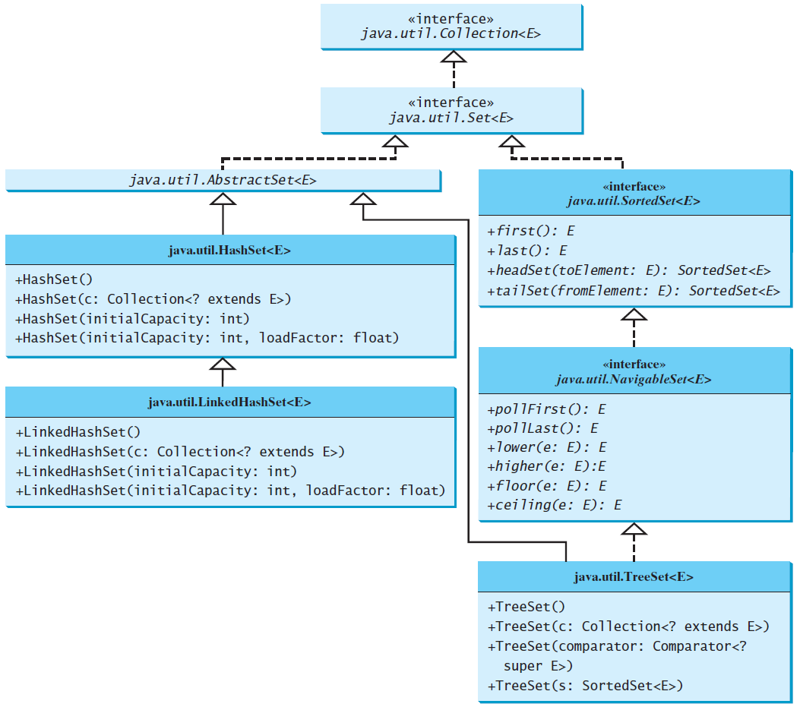
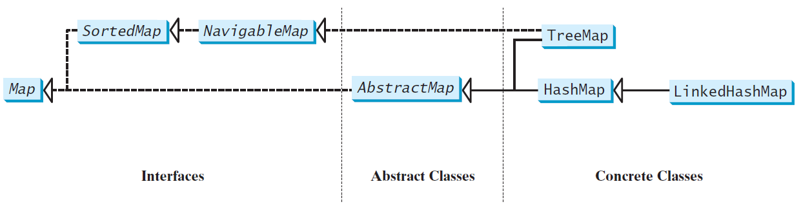
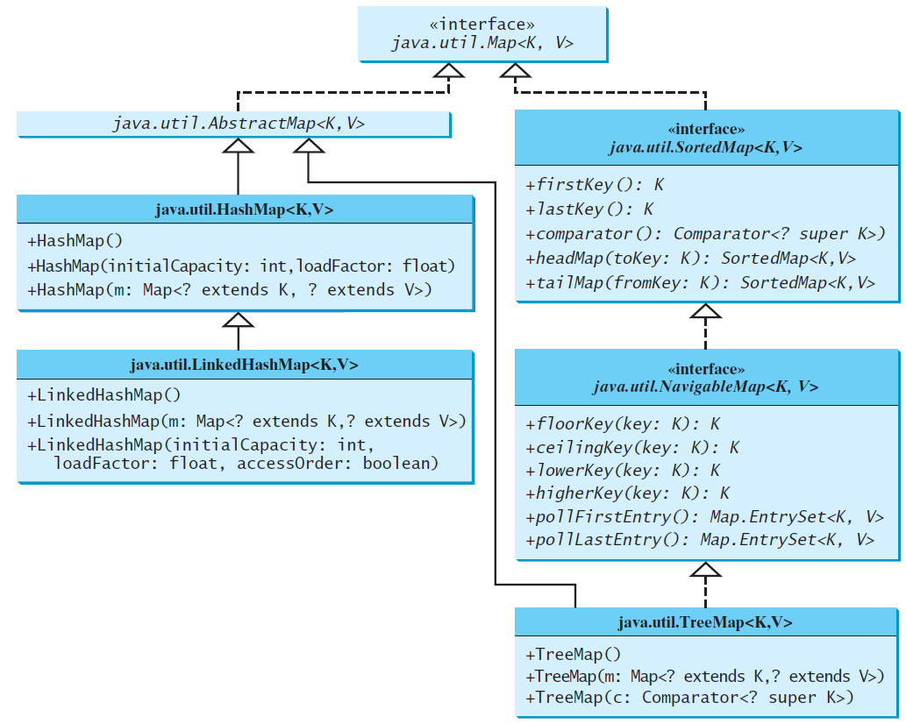

# Sets and Maps
Chapter 21

Objectives
---
- store unordered, nonduplicate elements using a set
  - compare HashSet, LinkedHashSet and TreeSet
  - compare sets and lists
- store key-value pairs using Map
  - compare HashMap, LinkedHashMap and TreeMap
  - compare Collection and Map
- Develop word counting programs using Set and Map
- Using static methods in Collections to obtain 
  - singleton sets, lists, and maps
  - unmodifiable sets, lists, and maps


Java Collection Framework hierarchy
---
- Set and List are subinterfaces of Collection
  


The Set Interface
---
- stipulates a Set contains no duplicate elements




The AbstractSet Class
---
- extends AbstractCollection and implements Set
- provides concrete implementations for 
  - the equals method
  - the hashCode method
- The hash code of a set is the sum of the hash code of all the elements in the set


The HashSet Class
---
- a concrete class


Practice 📝 Use HashSet and Iterator
---
```java
import java.util.*;

public class TestHashSet {
  public static void main(String[] args) {
    Set<String> set = new HashSet<>();

    set.add("London");
    set.add("Paris");
    set.add("New York");
    set.add("San Francisco");
    set.add("Beijing");
    set.add("New York");

    System.out.println(set);

    for (String s: set) {
      System.out.print(s.toUpperCase() + " ");
    }
    
    System.out.println();
    set.forEach(e -> System.out.print(e.toLowerCase() + " "));

    System.out.println();
  }
}
```


Practice 📝 Use LinkedHashSet
---
```java
import java.util.*;

public class TestLinkedHashSet {
  public static void main(String[] args) {
    Set<String> set = new LinkedHashSet<>();
    
    set.add("London");
    set.add("Paris");
    set.add("New York");
    set.add("San Francisco");
    set.add("Beijing");
    set.add("New York");

    System.out.println(set);

    for (String element: set)
      System.out.print(element.toLowerCase() + " ");
    System.out.println();
  }
} 
```


The SortedSet Interface and the TreeSet Class
---
- SortedSet guarantees that the elements in the set are sorted using
  - the Comparable interface
  - the Comparator interface
- TreeSet implements the SortedSet interface


Practice 📝 Use TreeSet to Sort Elements in a Set
---
```java
import java.util.*;

public class TestTreeSet {
  public static void main(String[] args) {
    Set<String> set = new HashSet<>();

    set.add("London");
    set.add("Paris");
    set.add("New York");
    set.add("San Francisco");
    set.add("Beijing");
    set.add("New York");

    TreeSet<String> treeSet = new TreeSet<>(set);
    System.out.println("Sorted tree set: " + treeSet);

    System.out.println("first(): " + treeSet.first());
    System.out.println("last(): " + treeSet.last());
    System.out.println("headSet(\"New York\"): " + 
      treeSet.headSet("New York"));
    System.out.println("tailSet(\"New York\"): " + 
      treeSet.tailSet("New York"));

    System.out.println("lower(\"P\"): " + treeSet.lower("P"));
    System.out.println("higher(\"P\"): " + treeSet.higher("P"));
    System.out.println("floor(\"P\"): " + treeSet.floor("P"));
    System.out.println("ceiling(\"P\"): " + treeSet.ceiling("P"));
    System.out.println("pollFirst(): " + treeSet.pollFirst());
    System.out.println("pollLast(): " + treeSet.pollLast());
    System.out.println("New tree set: " + treeSet);
  }
}
```


Practice 📝 Use Comparator to Sort Elements in a Set
---
- need [GeometricObject](./demos/TestComparator.java)
```java
import java.util.*;

public class TestTreeSetWithComparator {
  public static void main(String[] args) {
    Set<GeometricObject> set =
      new TreeSet<>(new GeometricObjectComparator());
    set.add(new Rectangle(4, 5));
    set.add(new Circle(40));
    set.add(new Circle(40));
    set.add(new Rectangle(4, 1));

    System.out.println("A sorted set of geometric objects");
    for (GeometricObject element: set)
      System.out.println("area = " + element.getArea());
  }
}
```


Practice 📝 Count Keywords
---
- counts the number of the keywords in a Java source code file
  - [source code](./demos/CountKeywords.java)


The Map Interface
---
- maps keys to the elements
- The keys are like indexes
  - In List, the indexes are integer
  - In Map, the keys can be any objects
    - get/put element from/to a map using a key




Concrete Map Classes
---


- interface java.util.Map.Entry<K,V> methods


HashMap
---
- efficient for 
  - locating a value
  - inserting a mapping
  - deleting a mapping
- unordered


LinkedHashMap
---
- extends HashMap with a linked list implementation 
- supports an ordering of the entries in the map
  - insertion order:
    - retrieve elements in the order in which they were inserted
    - constructed with the no-arg constructor
  - access order
    - from least recently accessed to most recently
    - constructed with LinkedHashMap(initialCapacity, loadFactor, true)


TreeMap
---
- implements SortedMap
- efficient for traversing the keys in a sorted order


Practice 📝 Use HashMap, LinkedHashMap, and TreeMap
---
- creates a hash map that maps borrowers to mortgages
- creates a tree map from the hash map
  - displays the mappings in ascending order of the keys

```java
import java.util.*;

public class TestMap {
  public static void main(String[] args) {
    Map<String, Integer> hashMap = new HashMap<>();
    hashMap.put("Smith", 30);
    hashMap.put("Anderson", 31);
    hashMap.put("Lewis", 29);
    hashMap.put("Cook", 29);

    System.out.println("Display entries in HashMap");
    System.out.println(hashMap + "\n");

    Map<String, Integer> treeMap = new TreeMap<>(hashMap);
    System.out.println("Display entries in ascending order of key");
    System.out.println(treeMap);

    Map<String, Integer> linkedHashMap =
      new LinkedHashMap<>(16, 0.75f, true);
    linkedHashMap.put("Smith", 30);
    linkedHashMap.put("Anderson", 31);
    linkedHashMap.put("Lewis", 29);
    linkedHashMap.put("Cook", 29);

    System.out.println("\nThe age for " + "Lewis is " +
      linkedHashMap.get("Lewis"));

    System.out.println("Display entries in LinkedHashMap");
    System.out.println(linkedHashMap);
    
    System.out.print("\nNames and ages are ");
    treeMap.forEach(
      (name, age) -> System.out.print(name + ": " + age + " "));
  }
}
```


Practice 📝 Count the Occurrences of Words in a Text
---
- count the occurrences of words in a text 
- display the words and their occurrences in ascending order of the words
- map a word (key) to its count (value)
  - increase the value for existing word (key) by 1
  - add nonexistent word and value 1 to the map

```java
import java.util.*;

public class CountOccurrenceOfWords {
  public static void main(String[] args) {
    String text = "Good morning. Have a good class. " +
      "Have a good visit. Have fun!";

    Map<String, Integer> map = new TreeMap<>();

    String[] words = text.split("[\\s+\\p{P}]");
    for (int i = 0; i < words.length; i++) {
      String key = words[i].toLowerCase();
      
      if (key.length() > 0) {
        if (!map.containsKey(key)) {
          map.put(key, 1);
        }
        else {
          int value = map.get(key);
          value++;
          map.put(key, value);
        }
      }
    }

    map.forEach((k, v) -> System.out.println(k + "\t" + v));
  }
}
```


The Singleton and Unmodifiable Collections
---
- singleton: immutable collections
  - singleton(o: Object): Set
  - singletonList(o: Object) : List
  - singletonMap(key: Object, value: Object): Map
- unmodifiable collections: read-only view
  - unmodifiableCollection(c: Collection): Collection
  - unmodifiableList(l: List): List
  - unmodifiableMap(m: Map): Map
  - unmodifiableSet(s: Set): Set
  - unmodifiableSortedMap(s: SortedMap): SortedMap
  - unmodifiableSortedSet(s: SortedSet): SortedSet


## Online resources
- [visualgo - visualize algorithms](https://visualgo.net/)
- [Liang animation](https://liveexample.pearsoncmg.com/liang/animation/animation.html)