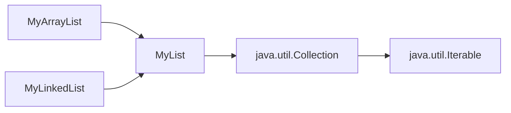

# Implementing Lists, Stacks, Queues, and Priority Queues
chapter 24


Objectives
---
- design common operations of lists in an interface extending Collection
- design and implement
  - an array list with an array
  - a linked list with a linked structure
  - a stack with an array list
  - a queue with a linked list
  - a priority queue with a heap  


Lists
---
- store data in sequential order
- common operations
  - create lists
  - retrieve, search, insert, delete elements
  - get list information
    - is it empty?
    - how many elements?
- dynamically growable and shrinkable


Two Ways to Implement Lists
---
- ArrayList - using array
  - create dynamically
  - grow and shrink automatically
- LinkedList - using linked list
  - a linked chain a dynamically created nodes




MyList interface
---
- [MyList.java](./demos/MyList.java)


ArrayList
---
- [MyArrayList.java](./demos/MyArrayList.java)


LinkedList
---
- [MyLinkedList.java](./demos/MyLinkedList.java)


Time complexity of ArrayList and LinkedList
---
| methods | ArrayList | LinkedList |
| --- | --- | --- |
| add(e: E) | $O(1)$  | $O(1)$ |
| add(index: int, e: E) | $O(n)$  | $O(n)$ |
| clear() | $O(1)$  | $O(1)$ |
| contains(e: E) | $O(n)$  | $O(n)$ |
| get(index: int) | $O(1)$  | $O(n)$ |
| indexOf(e: E) | $O(n)$  | $O(n)$ |
| isEmpty() | $O(1)$  | $O(1)$ |
| lastIndexOf(e: E) | $O(n)$  | $O(n)$ |
| remove(e: E) | $O(n)$  | $O(n)$ |
| size() | $O(1)$  | $O(1)$ |
| remove(index: int) | $O(n)$  | $O(n)$ |
| set(index: int, e: E) | $O(n)$  | $O(n)$ |
| addFirst(e: E) | $O(n)$  | $O(1)$ |
| removeFirst() | $O(n)$  | $O(1)$ |


Variations of Linked Lists 
---
- A circular, singly linked list is a singly linked list whose tail linked to its head
- A doubly linked list contains the nodes with two pointers
  - a forward pointer points to the next node 
  - a backward pointer points to the previous node
  - can be traversed forward and backward
- A circular, doubly linked list is doubly linked list whose tail and head linked together
  - the head backward pointer points to the tail
  - the tail forward pointer points to the head


Stack
---
- a first-in and last-out data structure
- its elements are accessed, inserted, and deleted only from its end 
  - called the top of the stack


Queue
---
- a first-in and first-out data structure
- represents a waiting list 
- its elements are inserted into its end (tail) 
- are accessed and deleted from its beginning (head) 


Implementing Stacks and Queues
---
- implement Stack with an array list
- implement Queue with a linked list
- two design methods
  - Using inheritance
    - Stack extends ArrayList
    - Queue extends LinkedList
  - Using composition
    - Stack has an ArrayList as a data field
    - Queue has a LinkedList as a data field
- Composition is Better
  - the designed Stack and Queue are completely new
  - don't care about unnecessary or inappropriate methods from parent interface


Practice 📝: write test programs for
- GenericStack
  ```java
  public class GenericStack<E> {
    private java.util.ArrayList<E> list = new java.util.ArrayList<>();

    public int getSize() {
      return list.size();
    }

    public E peek() {
      return list.get(getSize() - 1);
    }

    public void push(E o) {
      list.add(o);
    }

    public E pop() {
      E o = list.get(getSize() - 1);
      list.remove(getSize() - 1);
      return o;
    }

    public boolean isEmpty() {
      return list.isEmpty();
    }
    
    @Override
    public String toString() {
      return "stack: " + list.toString();
    }
  }
  ```
- GenericQueue
  ```java
    public class GenericQueue<E> {
    private java.util.LinkedList<E> list 
      = new java.util.LinkedList<E>();

    public void enqueue(E e) {
      list.addLast(e);
    }

    public E dequeue() {
      return list.removeFirst();
    }

    public int getSize() {
      return list.size();
    }

    @Override
    public String toString() {
      return "Queue: " + list.toString();
    }
  }  
  ```

Priority queue
---
- a type of queue whose elements have priorities
  - the element with the highest priority is dequeued first
- implemented with a heap
  ```java
  public class MyPriorityQueue<E> {
    private Heap<E> heap; 
    
    public MyPriorityQueue() {
      heap = new Heap<E>();
    }
    
    public MyPriorityQueue(java.util.Comparator<E> c) {
      heap = new Heap<E>(c);
    }
    
    public void enqueue(E newObject) {
      heap.add(newObject);
    }

    public E dequeue() {
      return heap.remove();
    }

    public int getSize() {
      return heap.getSize();
    }
  }
  ```


# References
- [Liang animation](https://liveexample.pearsoncmg.com/liang/animation/animation.html)