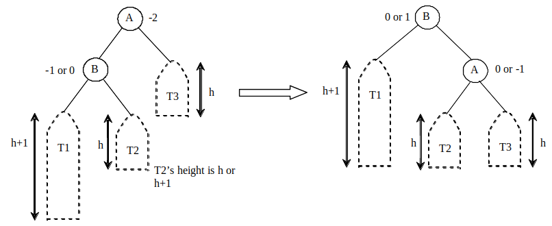
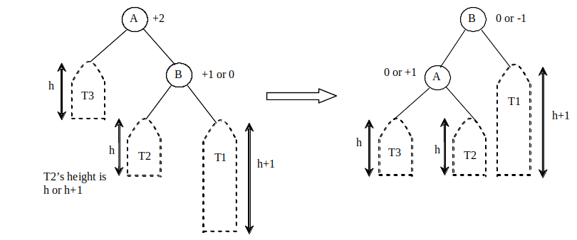
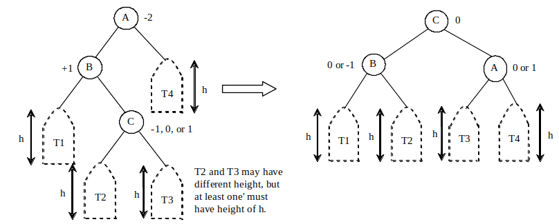
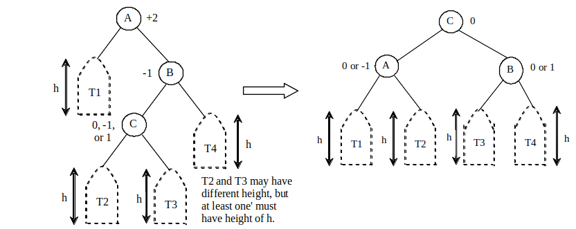

# AVL Trees
chapter 26

Objectives
---
- Explain AVL tree and design AVLTree class
- Rebalance AVL trees
  - using the LL rotation, LR rotation, RR rotation, and RL rotation
- Design, implement and analyze common operations on AVL trees
  - search insert, delete elements

Why AVL Tree? 
---
- the time complexity of common operations for a binary tree (BT) depend on the height of the tree
  - $O(n)$ in the worst case, the BT becomes a list
  - $O(\log n)$ when the BT is *complete*, or *perfectly balanced*
- making a BT perfectly balances is costly
  - the compromise is making it well-balanced 
- AVL trees are well-balanced
  - the difference between the heights of two subtrees for every node is 0 or 1
  - maximum height $O(\log n)$

Explore 🔍  AVL tree animation
---
- [Liang animation](https://liveexample.pearsoncmg.com/liang/animation/animation.html)

Balance Factor
---
- An AVL tree may need rebalance after inserting or deleting elements
-  *balance factor of a node (bf)* = height of its right subtree - height of its left subtree.
-  A node is 
   -  *balanced*: bf = {-1,0,1}
   -  *left-heavy*: bf <= -1
   -  *right-heavy*: bf >= 1

Balancing Trees
---
- rebalancing a node is called a *rotation*
- four possible rotations
  - LL rotation for LL imbalance
  - RR rotation for RR imbalance
  - LR rotation for LR imbalance
  - RL rotation for RL imbalance 

LL rotation for LL imbalance
---
- LL imbalance occurs at a node A when
  - $bf_A = -2$ and $bf_{leftChildB} \in \{0,-1\}$
- can be fixed by a single right rotation at A
- 

RR rotation for RR imbalance
---
- RR imbalance occurs at a node A when
  - $bf_A = 2$ and $bf_{rightChildB} \in \{0,1\}$
- can be fixed by a single left rotation at A
- 

LR rotation for LR imbalance
---
- LR imbalance occurs at a node A when
  - $bf_A = -2$ and $bf_{leftChildB} = 1$
- can be fixed by a double rotation
  - a single left rotation at B
  - a single right rotation at A
- 

RL rotation for RL imbalance
---
- RL imbalance occurs at a node A when
  - $bf_A = 2$ and $bf_{rightChildB} = -1$
- can be fixed by a double rotation
  - a single right rotation at B
  - a single left rotation at A
- 

Designing Classes for AVL Trees
---
- An AVL tree is a BT
  - define the AVLTree class to extend the BST class
- [AVLTree.java](./demos/AVLTree.java)
  - [TestAVLTree.java](./demos/TestAVLTree.java)

# Online resources
- [visualgo](https://visualgo.net/)
- [Liang animation](https://liveexample.pearsoncmg.com/liang/animation/animation.html)