# 2-4 trees and B trees
chapter 42


Objectives
---
- Describe 2-4 tree and B-tree
- Design and implement Tree24 class
  - implements the Tree interface
  - common operations 
    - traverse a 2-4 tree
    - search elements
    - insert elements
      - split nodes
    - delete elements
      - transfer and fuse node
- Index large amount of data by B-trees


What is 2-4 Tree? 
---
- a complete balanced search tree
  - all leaf nodes on the same level
  - a node may have 1, 2 or 3 elements
    - called 2-, 3-, and 4-node respectively
    - contains 2, 3, and 4 children respective
      - so shorter than a corresponding BST
    - 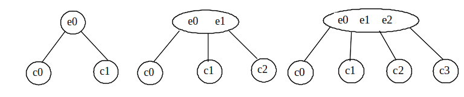
    - order of elements in a node
      - $E(c_0) \lt e_0 \lt E(c_1) \lt e_1 \lt E(c_2) \lt e_2 \lt E(c_3)$
- also called 2-3-4 tree
- 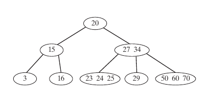


Explore 🔎 a 2-3-4 tree
---
- [2-3-4 tree](https://people.ksp.sk/~kuko/gnarley-trees/234tree.html)
  

Searching an Element 
---
- start from the root and scan downward
- search within a node
  - If not in the node, move to an appropriate subtree
- Repeat the process until 
  - a match is found or 
  - arrive at an empty subtree
- 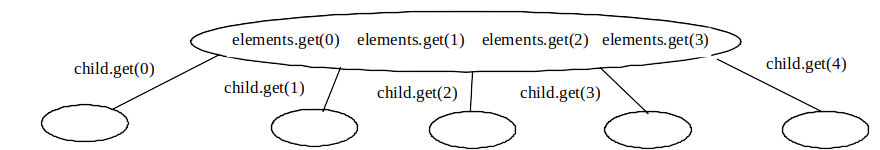

```java
boolean search(E e){
  current = root;

  while(current != null){
    if(match(e, current)){
      return true;
    }else{
      current = getChildNode(e, current);
    }
  }
  return false;
}
```

Inserting an Element
---
- locate a leaf node for insertion
  - 2-node or 3-node, insert the element
  - 4-node,  perform a split operation to avoid overflow
    - suppose $e_0 \lt e \lt e_1$
    - if the parent of this leaf 4-node is a 3-node
      - 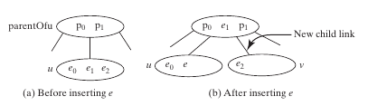
    - if the parent  of this leaf 4-node is a 4-node
      - split the parent node as splitting a leaf 4-node
      - insert the element along with its right child
      - 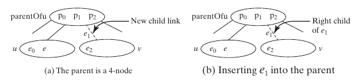
- the algorithm
  - 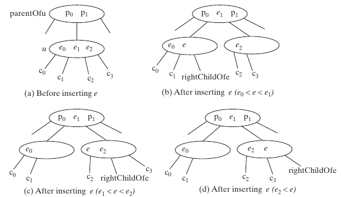
  - Let $u$ be the 4-node (*leaf or nonleaf*) in which the element $e$ will be inserted and the $parentOfu$ be the parent of $u$ as shown in (a) above
  - Create a new node named $v$, move $e_2$ and its children $c_2$ and $c_3$ to $v$
  - If $e \lt e_1$, insert $e$ along with its right child link to $u$; otherwise insert $e$ along with its right child link to $v$, as shown in (b),(c),(d) for the cases $e_0  \lt  e  \lt  e_1, e_1  \lt e \lt e_2, e_2 \lt e$ respectively
  - Insert $e_1$ along with its right child $v$ to the parent node, *recursively*

```java
public boolean insert (E e){
  if(root == null)
    root = new Tree24Node<E>(e);
  else{
    Locate leafNode for inserting e
    insert(e, null, leafNode);
  }
  size++;
  return true;
}

private void insert(E e, Tree24Node<E> rightChildOfe, Tree24Node<E> u){
  if(u is a 2- or 3- node){
    insert23(e, rightChildOfe, u);
  }else{
    Tree24Node<E> v = new Tree24Node<E>();
    E median = split(e, rightChildOfe, u, v);

    if(u == root){
      root = new Tree24Node<E>(median);
      root.child.add(u);
      root.child.add(v);
    }else{
      Get the parent of u, parentOfu;
      insert(median, v, parentOfu);
    }
  }
}
```


Practice 📝 Insert elements into a 2-4 tree
---
- Create a 2-4 tree on [Liang animation](https://liveexample.pearsoncmg.com/liang/animation/animation.html) by inserting 34,3,50,20,15,16,25,27,29,24 into an empty tree one by one
- Describe the tree changes while inserting each element


Deleting an Element
---
- search and locate the node $u$ that contains the element $e$
  - return false if not found
  - found the node $u$ and its parent $parentOfu$
    - **Case 1**: $u$ is a leaf 3- or 4- node, delete $e$ from $u$
    - **Case 2**: $u$ is a leaf 2-node, delete e renders $u$ empty, called *underflow*, which can be remedied
      - Case 2.1: if $u$'s immediate left or right sibling $w$ is a 3- or 4- node
        - *transfer* an element from $parentOfu$ to $u$
        - move an element from $w$ to occupy the hole in $parentOfu$
        - 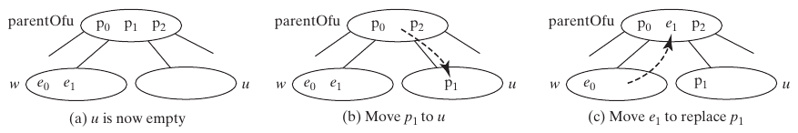
      - Case 2.2: if both $u$'s immediate left $w$ and right siblings are 2-node and exist ($u$ may have only one sibling)
        - perform a *fusion* operation to discard $u$ and move an element from $parentOfu$ to $w$
          - If $parentOfu$ becomes empty, repeat Case 2 recursively on it with *transfer and fusion*
        - 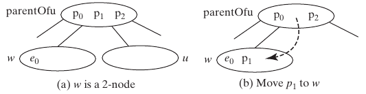
    - **Case 3**: $u$ is a nonleaf node
      - find the rightmost leaf node $w$ in the left subtree of $e$
      - move the last element in $w$ to replace $e$ in $u$
        - if $w$ becomes empty, apply a transfer or fusion operation on $w$
      - 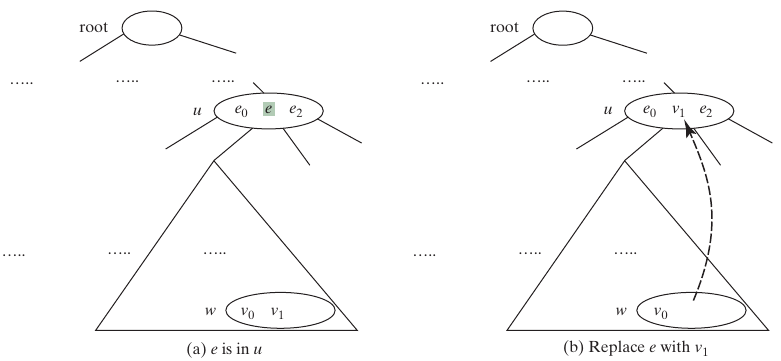

```java
public boolean delete(E e){
  Locate the node u that contains e
  if(u is found){
    delete(e, u);
    size--;
    return true;
  }

  return false;
}

private void delete(E e, Tree24Node<E> u){
  if(u is a leaf node){
    ArrayList<Tree24Node<E>> p = path(e);
    Remove e from u;
    // check possible underflow along the path p and fix it
    validate(e, u, p);
  }else{
    Locate the rightmost node w in the left subtree of node u;
    Get the rightmost element v1 from w;
    ArrayList<Tree24Node<E>> p = path(v1);
    Replace e with v1
    // check possible underflow along the path p and fix it
    validate(v1, w, p);
  }
}

private void validate(E e, Tree24Node<E> u, ArrayList<Tree24Node<E>> path){
  for(int i= path.size()-1; i>=0; i--){
    if(u is not empty)
      return;

    Tree24Node<E> parentOfu = path.get(i-1);
    if(left sibling of u has more than one element){
      Perform a transfer on u with its left sibling
    }
    else if(right sibling of u has more than one element){
      Perform a transfer on u with its right sibling
    }
    else if(u has left sibling){
      Perform a fusion on u with its left sibling
      u = parentOfu
    }else{
      Perform a fusion on u with its right sibling
      u = parentOfu
    }
  }
}
```

Practice 📝 Delete elements from a 2-4 tree
---
- Create a 2-4 tree on [Liang animation](https://liveexample.pearsoncmg.com/liang/animation/animation.html) by inserting into an empty tree one by one with 1, 2, 3, 4, 10, 9, 7, 5, 8, 6, 17, 25, 18, 26, 14, 52, 63, 74, 80, 19,  27
- Describe the transfer and fusion operations happened while deleting the elements in order 1, 2, 3, 4, 10, 9, 7, 5, 8,  6


Traverse a 2-4 tree
---
- A 2-4 tree can be traversed with  inorder, preorder, and postorder
  -  Inorder traversal visits the elements in increasing order
  -  Preorder traversal visits the elements in the root, 
     -  then recursively visits the subtrees from the left to right
  -  Postorder traversal visits the subtrees from the left to right recursively, 
     -  then the elements in the root


Practice 📝 Traverse a 2-4 tree
---
- print out the elements while traversing the 2-4 tree below
  - 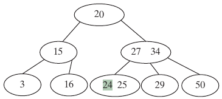
  - inorder prints?
  - preorder prints?
  - postorder prints?
- verify your solution with [Liang animation](https://liveexample.pearsoncmg.com/liang/animation/animation.html)


Design classes for 2-4 trees
---
- 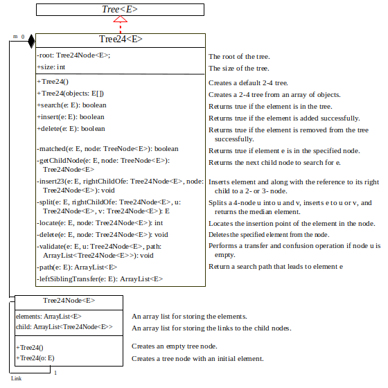
- source code
  - [Tree24.java](./demos/Tree24.java)
  - [TestTree24.java](./demos/TestTree24.java)
- visualize the changes of the 2-4 in [TestTree24.java](./demos/TestTree24.java) with [Liang animation](https://liveexample.pearsoncmg.com/liang/animation/animation.html)

Time-complexity analysis
---

| operation | time complexity |
| --- | --- |
| search | $O(\log n)$ |
| insert | $O(\log n)$ |
| delete | $O(\log n)$ |

- Analysis
  - the height of a 2-4 tree: $O(\log n)$
  - search, insert, and delete methods operate on the nodes along a *path* in the tree
    - search an element within a node: $O(1)$
    - split a node: $O(1)$
    - transfer and fusion operations: $O(1)$


What is a B-Tree of order $d$? 
---
-  a generalization of the 2-4 tree
-  used to organize data stored on secondary storage such as hard disks
-  a b-tree of order 6
- 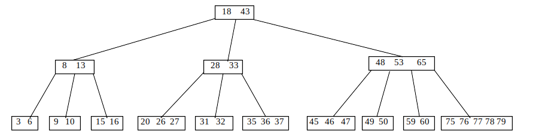
- Each non-root node contains from $⌈\frac{d}{2}⌉ -1$ to $d-1$ keys
  - A 2-4 tree is a B-tree of order 4
- The root may contain from 0 to $d-1$ keys
- A nonleaf node with $k$ keys has $k+1$ children
- All leaf nodes have the same depth


A B-tree is a search tree
---
- 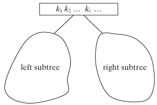
-  The keys in each node are placed in *increasing* order
-  Each key in an interior node has a left subtree and a right subtree
-  All keys in the left subtree are less than the key in the parent node
-  All keys in the right subtree are greater than the key in the parent node


Insert a key to a B-tree
---
- locate the leaf node $u$ then insert the key $k$
- perform a *split* operation to fix overflow 
  - when the leaf node $u$ has $d$ keys after the insertion
    - let $k_p$ denote the median key in $u$
  - create a new node $v$ and move all keys greater than $k_p$ to it
  - insert $k_p$ to the parent node $parentOfu$ of $u$
    - now $u$ becomes the left child of $k_p$
    - $v$ becomes the right child of $k_p$
    - if this insertion causes an overflow on $parentOfu$
      - repeat similar split process on $parentOfu$
  - 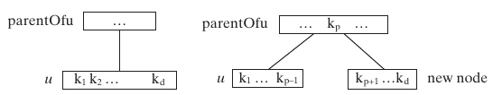
- common operations such as insert, delete, search, traverse are similar to 2-4 tree
  - can be generalized from those of 2-4 tree


Delete a key from a B-tree
---
- locate the node $u$ that contains the key $k$
  - **Case 1**: $u$ is a leaf node, remove $k$ from $u$
    - underflow occurs when $u$ has less than $⌈\frac{d}{2}⌉ -1$ keys, to remedy it
      - perform a transfer with a sibling $w$ of $u$ has more than $⌈\frac{d}{2}⌉ -1$ keys if such sibling exists
        - 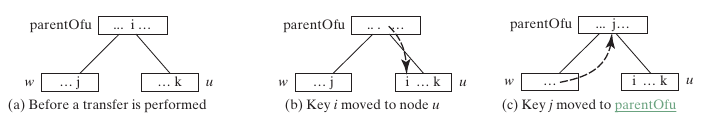
      - otherwise, perform a fusion with a sibling $w$ of $u$
        - 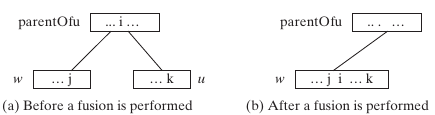
  - **Case 2**: $u$ is a nonleaf node
    - find the rightmost leaf node $w$ in the left subtree of $k$
    - move the last key $i$ in $w$ to replace $k$ in $u$
      - 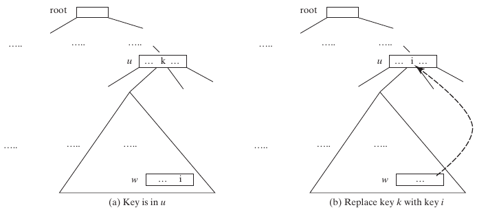
    - if $w$ becomes underflow, apply a transfer or fusion operation


B-tree performance
---
-  improve performance by reducing the number of disk I/Os
   -  Disk I/O is thousands of times slower than memory access
   -  The basic unit of the IO operations on a disk is a block
      - choose an appropriate order $d$ so that a node can fit in a single disk block
   - common operations depends on the height of the B-tree 
     - worst case: each node contains $⌈\frac{d}{2}⌉-1$ keys so the height of the B-tree is $\log_{⌈\frac{d}{2}⌉}n$
     - best case: each node contains $d-1$ keys so the height of the B-tree is $\log_d n$


# Online resources
- [visualgo](https://visualgo.net/)
- [Liang animation](https://liveexample.pearsoncmg.com/liang/animation/animation.html)