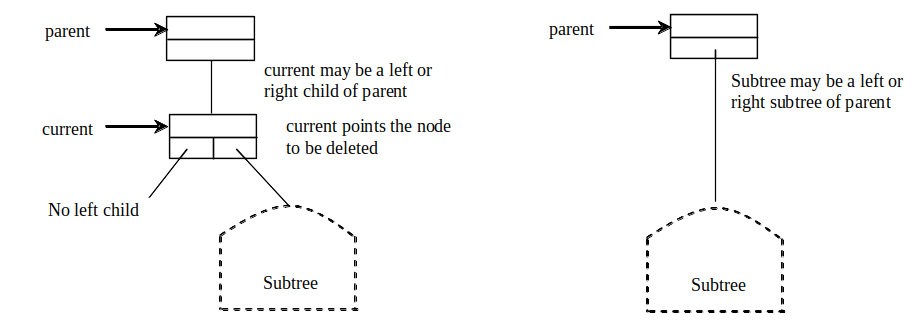
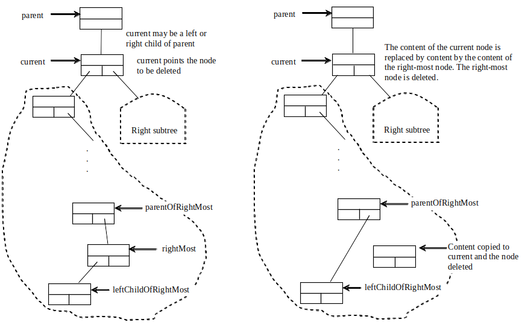
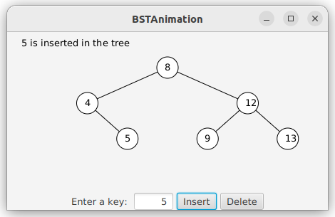
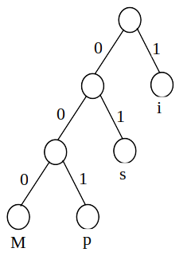
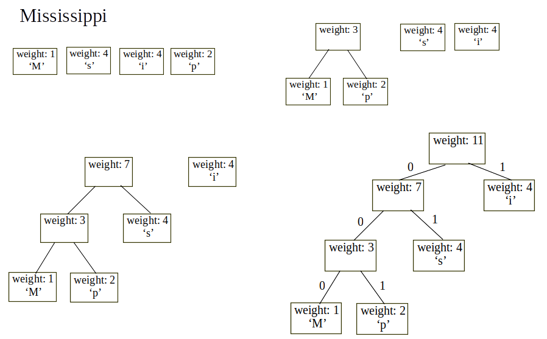

# Binary Search Trees


Objectives
---
- Design and implement a binary search tree (BST)
  - represent BSTs with linked data structures
  - common operations
    - search, traverse insert, and delete elements
      - create iterators for traverse
    - visualization
- Implement Huffman coding for compressing data using a BST


Binary tree (BT)
---
- a hierarchical structure
- could be
  - empty
  - an element called *root* and two distinct BTs, called *left subtree* and *right subtree*


BT Terms
---
- The root of left (right) subtree of a node is called a left (right) child of the node
- A node without children is called a leaf
- Every node in a binary search tree (with no duplicate elements) has the properties
  - the value of any node in its left subtree is less than the value of the node 
  - the value of any node in its right subtree is greater than the value of the node


Representing BTs
---
- A BT can be represented using a set of linked nodes 
- Each node contains 
  - a value and
  - two links named left and right that reference the left child and right child respectively
  ```java
  class TreeNode<E> {
    E element;
    TreeNode<E> left;
    TreeNode<E> right;

    public TreeNode(E e){
      element = e;
    }
  }
  ```


Tree traversal
---
- visits each node in the tree exactly once in many ways
  - inorder, preorder, postorder, 
  - depth-first, and breadth-first traversals
- inorder traversal: (left, node, right)
  - visit the left subtree of the current node first recursively 
  - then the current node itself
  - and finally the right subtree of the current node recursively
- postorder traversal: (left, right, node)
- preorder traversal: (node, left, right)
- breadth-first traversal visits the nodes level by level
  -  First visit the root
  - then all children of the root from left to right
  - then grandchildren of the root from left to right, and so on


The tree interface
---
- implements java.lang.Collection\<E\>
- defines common operations for trees
- [Tree.java](./demos/Tree.java)


The BST class
---
- implements interface Tree\<E\>
- contains zero or more TreeNode\<E\>
- [BST.java](./demos/BST.java)


Practice 📝 Use BTs
---
- creates a BT using BST
- Add strings into the BT
  - draw the BST
- traverse the tree in inorder, postorder, and preorder
- [TestBST.java](./demos/TestBST.java)


Deleting Elements in a BST
---
- handle two cases:
- Case 1: The current node does not have a left child
  - 
- Case 2: The current node has a left child
  - 
- [TestBSTDelete.java](./demos/TestBSTDelete.java)


BT time complexity
---
- inorder, preorder, and postorder: $O(n)$
  - $n$ - number of nodes in the BT
- search, insertion and deletion: $O(h)$
  - $h$ - height of the BT
  - worst case: $O(n)$


Tree visualization
---
- 
- [BSTAnimation.java](./demos/BSTAnimation.java)
  - [BTView.java](./demos/BTView.java)


Iterator
---
- provides a uniform way for traversing the elements in a container 
  - such as a set, list, BT, etc. 
- [TestBSTWithIterator.java](./demos/TestBSTWithIterator.java)


Data Compression: [Huffman Coding](https://en.wikipedia.org/wiki/Huffman_coding) 
---
- uses fewer bits to encode more frequently occurring characters
- The codes for characters are constructed based on 
  - the occurrence of characters in the text using a BT, 
  - called the *Huffman coding tree*


Practice 📝 create the Huffman coding tree for string "Mississippi"
---
| Character | Code | Frequency |
| --- | --- | --- |
| M | 000 | 1 |
| p | 001 | 2 |
| s | 01 | 4 |
| i | 1 | 4 |

- 


Constructing Huffman Tree
---
- use a greedy algorithm as follows:
  - Begin with a forest of trees
    - Each tree contains a node for a character
    - The weight of the node is the frequency of the character in the text
  - Repeat this step until there is only one tree:
    - Choose two trees with the smallest weight and create a new node as their parent
    - The weight of the new tree is the sum of the weight of the subtrees
- 
- [HuffmanCode.java](./demos/HuffmanCode.java)
  - [Heap.java](../mod2/demos/Heap.java)


# References
- [visualgo](https://visualgo.net/)
- [Liang animation](https://liveexample.pearsoncmg.com/liang/animation/animation.html)