# Red-Black Trees
chapter 43


Objectives
---
- Describe red-black trees
- Convert a red-black tree to a 2-4 tree and vice versa
- Design, implement and test RBTree class
- Insert elements in a red-black tree and solve the possible problems
  - double red problem
  - double black problem
- Compare the performance of AVL trees, 2-4 trees and red-black trees


What is a Red Black Tree? 
---
- A binary search tree derived from a 2-4 tree
- Each node has a color attribute red or black
  - The root is black
  - Two adjacent nodes cannot be both red

| a red-black tree | equivalent 2-4 tree |
| --- | --- |
| 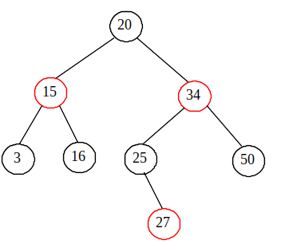 | 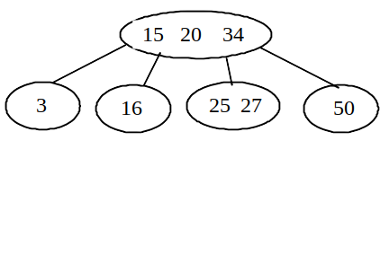 |

- A node is called external if its left or right subtree is empty
  - a leaf node is external
  - an external node is not necessarily a leaf node
- The black depth of a node = the number of black nodes in the path from the node to the root
  - All external nodes have the same black depth


Practice 📝
---
In the red-black tree above
- Find all external nodes
- Find all nonleaf external nodes
- Find the black depth of each node


Conversion between Red-Black Trees and 2-4 Trees 
---
- red-black tree to  2-4 tree 
  - merge any red nodes with its parent to create a 3-node or a 4-node
- 2-4 tree to red-black tree
  - perform the transformations for each node $u$
    - if $u$ is a 2-node , color it black
    - if $u$ is a 3-node contains  $e_0, e_1$
      - make $e_0$ the parent of $e_1$ or vice versa
      - color the parent black and the child red
    - if $u$ is a 4-node contains  $e_0, e_1,e_2$
      - make $e_1$ the parent of $e_0$ and $e_2$
      - color the parent $e_1$ black and the children $e_0$ and $e_2$ red
  - 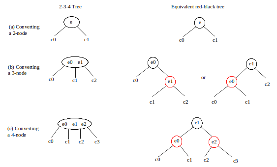
  - the conversion from a 2-4 tree to a red-black tree is *not unique*
  - 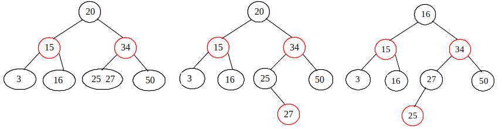


Design and implement classes for red-black trees
---
- 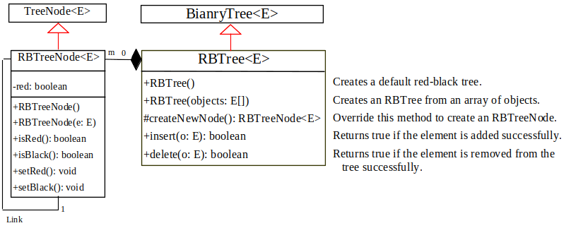
- source code
  - [RBTree.java](./demos/RBTree.java)
  - [TestRBTree.java](./demos/TestRBTree.java)


Overriding the insert method
---
- always insert $e$ as a leaf node
  - color it black if the new node $u$ is the root otherwise red
- If the parent $v$ of $u$ is red, a *double-red violation* occurs
- fix the violation in two cases: let $w$ be the parent of $v$, $x$ the sibling of $v$
  - **Case 1**: 
    - $x$ is black or null then 
    - there are 4 possible configurations for $u,v,w,x$ shown as (a)s below
    - in which $y_1, y_2, y_3$ may be null
    - $u,v,w$ form a 4-node in the corresponding 2-4 tree 
      - but represented incorrectly in the red-black tree
    - case 1.1: $u \lt v \lt w$
      - 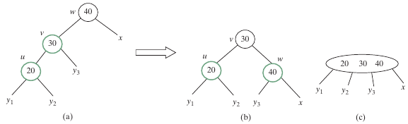
    - case 1.2: $v \lt u \lt w$
      - 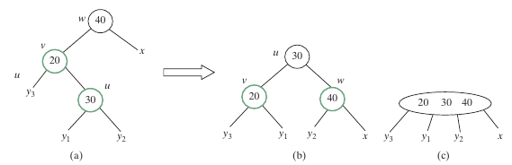
    - case 1.3: $w \lt v \lt u$
      - 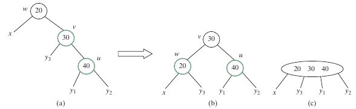
    - case 1.4: $w \lt u \lt v$
      - 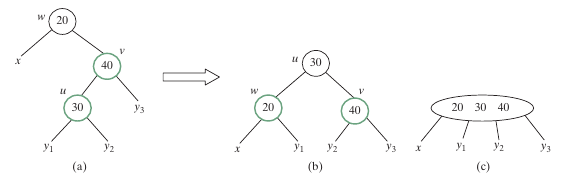
  - **Case 2**: 
    - $x$ is red then 
    - there are 4 possible configurations for $u,v,w,x$ shown as below
      - each corresponds to an overflow in the corresponding 4-node in a 2-4 tree
      - 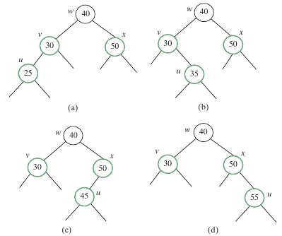
    - split fix overflow in the 2-4 tree 
      - equivalent recolor fix double-red violation in the red-black tree
      - now $w$ is red
        - if $parentOfw$ is black, done
        - otherwise, a new double-red violation occurs at $w$
          - use the same process to fix the violation *recursively*
      - 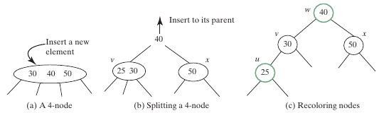

```java
public boolean insert(E e){
  boolean successful = super.insert(e);
  if(!successful)
    return false; // e already in the RBTree
  else{
    ensureRBTree(e);
  }
  return true;
}

private void ensureRBTree(E e){
  Get the path from root to e
  int i = path.size()-1;
  Get u,v from the path, u contains e, v is the parent of u;
  Color u red;

  if(u==root)
    u.setBlack();
  else if(v.isRed())
    fixDoubleRed(u,v,path,i);
}

private void fixDoubleRed(RBTreeNode<E> u, RBTreeNode<E> v, ArrayList<TreeNode<E>> path, int i){
  Get the grandparent w of u;

  RBTree<E> x = (w.left == v)? (RBTreeNode<E>)(w.right) : (RBTreeNode<E>)(w.left);

  if(x==null || x.isBlack()){// Case 1: v's sibling x is black
    if(w.left==v && v.left==u){
      // Case 1.1: u < v < w, Restructure and recolor nodes 
    }else if(w.left==v && v.right==u){
      // Case 1.2: v < u < w, Restructure and recolor nodes
    }else if(w.right==v && v.right==u){
      //  Case 1.3: w < v < u, Restructure and recolor nodes
    }else{
      // Case 1.4: w < u < v, Restructure and recolor nodes
    }
  }else{// Case 2: v's sibling x is red
    Color w and u red
    Color two children of w black

    if(w is root){
      w.setBlack();
    }else if(the parent of w is red){
      // Propagate along the path to fix new double-red violation
      u = w;
      v = parent of w;
      fixDoubleRed(u,v,path, i-2);
    }
  }
}
```

Practice 📝
---
- Try common operations on a red-black tree with [Liang animation](https://liveexample.pearsoncmg.com/liang/animation/animation.html)
  - insert into an empty red-black tree with 
    -  34, 3, 50, 20, 15 , 16, 25, and 27
  - describe the changes in each insert


Overriding the delete Method
---
- search and locate the node $u$ with the element $e$
  - $e$ is not in the tree, return false
- if $u$ is an internal node with both left and right children
  - find the rightmost node $v$ in the left subtree of $u$
  - replace $e$ in $u$ with the element in $v$
- If $u$ is an external node
  - then it has at most one child $childOfu$ 
    - which may be empty
  - delete $u$ by connecting $childOfu$ with $parentOfu$
  - 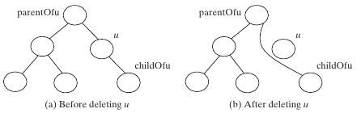
  - Consider the following cases
    - If $u$ is red, done
    - If $u$ is black and $childOfu$ is red, 
      - color $childOfu$ black to maintain the black height of $childOfu$ 
    - otherwise, assign $childOfu$ a fictitious *double black* as (a) in the table below
      - which is called a *double-black problem*
        - the black depth is shorten by 1

| (a) childOfu is denoted double black | (b) u corresponds to an empty node in a 2-4 tree |
| --- | --- |
| 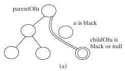  | 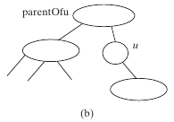  |

- A double black  in a red-black tree corresponds to an empty node for u in the corresponding 2-4 tree as (b) in the table above
  - can be fixed by equivalent transfer and fusion operations with three cases
  - **Case 1**: The sibling $y$ of childOfu is black and has a red child
    - This case has four possible configurations shown in the (a)s below
      - The dashed ­circle denotes that the node is either red or black
      - Case 1.1: The sibling $y$ of $childOfu$ is black and $y_1$ is red
      - 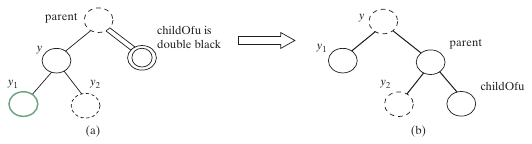
      -  Case 1.2: The sibling $y$ of $childOfu$ is black and $y_2$ is red
      - 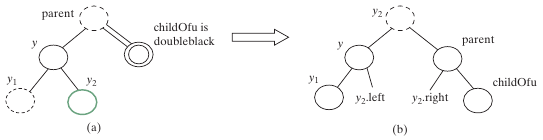
      -  Case 1.3: The sibling $y$ of $childOfu$ is black and $y_1$ is red
      - 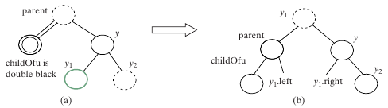 
      -  Case 1.4: the sibling $y$ of $childOfu$ is black and $y_2$ is red
      - 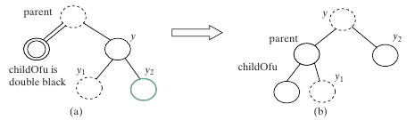 
    - case 1 corresponds to a transfer operation in the corresponding 2-4 tree
    - 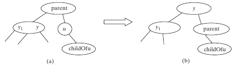
  - **Case 2**: The sibling $y$ of $childOfu$ is black and its children are black or null
    - change $y$’s color to red
      - If parent is red, change it to black, done
        - 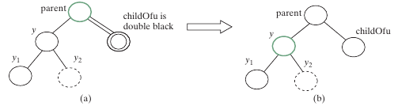
      - If parent is black, we denote parent double black
        - The double-black problem propagates to the parent node
        - 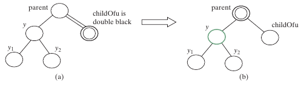
      - Case 2 corresponds to a fusion operation in the corresponding 2-4 tree
        - 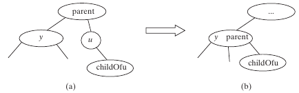
  - **Case 3**: The sibling $y$ of $childOfu$ is red, perform an adjustment operation
    - If $y$ is a left child of parent
    - 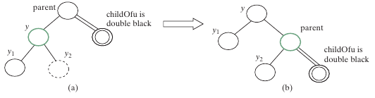
    - If y is a right children of parent
    - 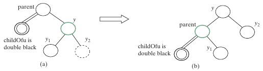
    - In both cases, color $y$ black and parent red 
      - $childOfu$ is still a fictitious double-black node
      - After the adjustment, the sibling of $childOfu$ is now black, and either Case 1 or Case 2 applies
        - If Case 1 applies, 
          - a one-time restructuring and recoloring operation eliminates the double-black problem 
        - If Case 2 applies, 
          - the double-black problem cannot reappear, since parent is now red
      - Therefore, one-time application of Case 1 or Case 2 will complete Case 3
    - Case 3 results from the fact that a 3-node may be transformed in two ways to a red-black tree
      - 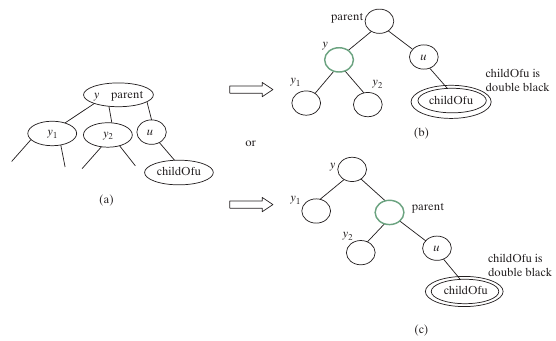

```java
public boolean delete(E e){
  Locate the node to be deleted
  if(the node is not found)
    return false;

  if(the node is an internal node){
    Find the rightmost node in the subtree of the node;
    Replace the element in the node with the one in rightmost;
    The rightmost node is the node to be deleted now;
  }

  Obtain the path from the root to the node to be deleted;

  deleteLastNodeInPath(path);
  size--;
  return true;
}

public void deleteLastNodeInPath(ArrayList<TreeNode<E>> path){
  Get the last node u in the path;
  Get parentOfu and grandparentOfu in the path;
  Get childOfu from u;
  Delete node u. Connect childOfu with parentOfu;

  if (childOfu == root || u.isRed())
    return;
  else if (childOfu != null && childOfu.isRed())
    childOfu.setBlack();
  else
    fixDoubleBlack(grandparentOfu, parentOfu, childOfu, path, i);
}

private void fixDoubleBlack(RBTreeNode<E> grandparent, RBTreeNode<E> parent,
RBTreeNode<E> db, ArrayList<TreeNode<E>> path, int i){
  Obtain y, y1, and y2;
  if (y.isBlack() && y1 != null && y1.isRed()){
    if (parent.right == db){
      // Case 1.1: y is a left black sibling and y1 is red
      Restructure and recolor parent, y, and y1 to fix the problem;
    }else{
      // Case 1.3: y is a right black sibling and y1 is red
      Restructure and recolor parent, y1, and y to fix the problem;
    }
  }else if(y.isBlack() && y2 != null && y2.isRed()){
    if (parent.right == db){
      // Case 1.2: y is a left black sibling and y2 is red
      Restructure and recolor parent, y2, and y to fix the problem;
    }else{
      // Case 1.4: y is a right black sibling and y2 is red
      Restructure and recolor parent, y, and y2 to fix the problem;
    }
  }else if(y.isBlack()){
    // Case 2: y is black and y's children are black or null
    Recolor y to red;
    if (parent.isRed())
      parent.setBlack(); // Done
    else if(parent != root){
      // Propagate double black to the parent node
      // Fix new appearance of double black recursively
      db = parent;
      parent = grandparent;
      grandparent = (i >= 3) ? (RBTreeNode<E>)(path.get(i − 3)) : null;
      fixDoubleBlack(grandparent, parent, db, path, i − 1);
    }
  }else if(y.isRed()){
    // Case 3.1: y is a left red child of parent
    parent.left = y2;
    y.right = parent;
  }else{
    // Case 3.2: y is a right red child of parent
    parent.right = y.left;
    y.left = parent;
  }
  parent.setRed();
  y.setBlack();
  connectNewParent(grandparent, parent, y); // y is new parent
  fixDoubleBlack(y, parent, db, path, i − 1);
}
```


Practice 📝
---
- Follow the previous practice
  - delete elements below from the red-black tree one by one
    - 50, 20, 15, 3, 25, 16, 34, 27
  - describe the changes in each delete


Performance of AVL trees, 2-4 trees and red-black trees
---
| methods | red-black tree | 2-4 tree | AVL tree | 
| --- | --- | --- | --- |
| search(e: E) | $O(\log n)$ | $O(\log n)$ | $O(\log n)$ |
| insert(e: E) | $O(\log n)$ | $O(\log n)$ | $O(\log n)$ |
| delete(e: E) | $O(\log n)$ | $O(\log n)$ | $O(\log n)$ |
| getSize() | $O(1)$ | $O(1)$ | $O(1)$ |
| isEmpty() | $O(1)$ | $O(1)$ | $O(1)$ |

- [TreePerformanceTest.java](./demos/TreePerformanceTest.java)
- the height of a red-black tree is at most twice the height of its corresponding 2-4 tree
- even though the three types of trees has same time complexity, but
  - red-black tree is more efficient than the other two for insert and delete
    - it required only one-time restructuring of the nodes
    - a 2-4 tree may require many splits
- as a binary research tree, red-black tree is more space-efficient than a 2-4 tree
  - a 2-4 tree wastes space for 2- and 3-nodes since its node can hold up to 3 elements
- java.util.TreeSet and java.util.TreeMap are implemented  with red-black tree


# Online resources
- [visualgo](https://visualgo.net/)
- [Liang animation](https://liveexample.pearsoncmg.com/liang/animation/animation.html)