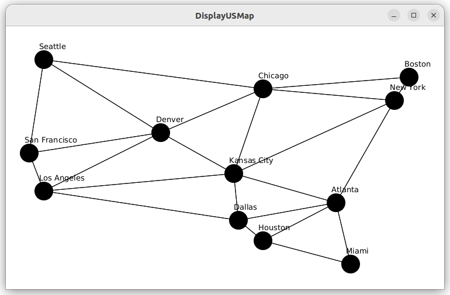
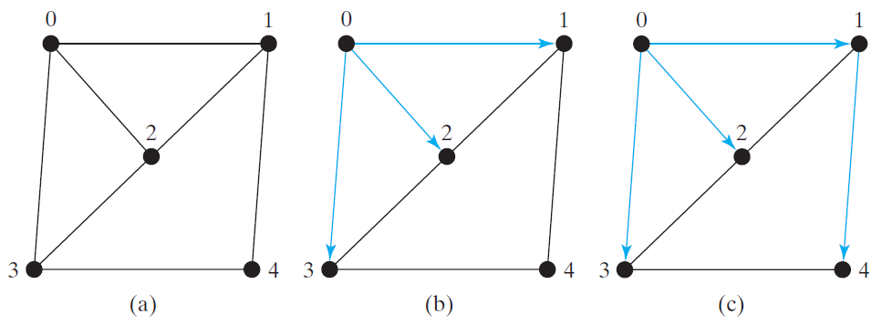

# Graphs and Applications
chapter 28


Objectives
---
- model and solve real-world problems with graphs
  - Seven Bridges of Königsberg problem
  - connected-circle problem
  - nine-tail problem
- describe graphs with
  - vertices, edges, simple graphs, weighted/unweighted graphs 
  - directed/undirected graphs
- design and implement 
  - interface Graph
  - class AbstractGraph and UnweightedGraph
  - class AbstractGraph.Tree representing graph traversal
  - two graph search algorithms
    - depth-first search
    - breadth-first search
- visualize graphs


Modeling Using Graphs
---
- A graph consists of 
  - vertices: $V=\{v_1, v_2, \cdots, v_n \}$
  - edges: $E=\{(v_1, v_3), (v_1, v_9), \cdots, (v_i, v_j)\}$
- us cities
  - 
- [Seven Bridges of Königsberg](https://en.wikipedia.org/wiki/Seven_Bridges_of_K%C3%B6nigsberg)
  - [Seven Bridges of Königsberg](./images/seven.png)


Explore 🔎 graph animation
---
- [Liang animation](https://liveexample.pearsoncmg.com/liang/animation/animation.html)


Basic Graph Terminologies 
---
| term | example |
| --- | --- |
| $G=(V, E)$ <br/> Directed vs. undirected  <br/> Weighted vs. unweighted  <br/>Adjacent vertices |  |
| loop <br/> Parallel edge <br/> Simple graph <br/> Complete graph |  |
| spanning tree |  |


Representing Graphs
---
- vertices: 
  - array of vertex objects
    ```java
    V[] vertices = {v1, v2, ..., vn};
    ```
- edges: 
  - array of vertex pairs
    ```java
    V[][] edges = {{v1,v3}, {v1, v9}, ..., {vi, vj}};
    ```
  - list of edge objects
    ```java
    public class Edge {
      int u, v;
      public Edge(int u, int v) {
        this.u = u;
        this.v = v;
      }
    }
    List<Edge> list = new ArrayList<>();
    list.add(new Edge(1, 3)); list.add(new Edge(1, 9)); …
    ```
  - adjacency matrices
    ```java
    int[][] adjacencyMatrix = {
      {1, 2, 0},
      {0, 2, 3},
      {7, 5, 1}
    };
    ``` 
  - adjacency vertex list 
    ```java
    // array of vertex list
    List<Integer>[] neighbors = new List[nodeNumber+1];
    neighbors[1] = new ArrayList<Integer>();
    neighbors[1].add(3), neighbors[1].add(9);

    // list of vertex list
    List<List<Integer>> neighbors = new ArrayList<>();
    neighbors.add(new ArrayList<Integer>()), neighbors.add(new ArrayList<Integer>());
    neighbors.get(1).add(3), neighbors.get(1).add(9);
    ```
  - adjacency edge list
    ```java
    // array of edge list
    List<Edge>[] neighbors = new List[nodeNumber+1];

    // list of edge list
    List<ArrayList<Edge>> neighbors = new ArrayList<>();
    neighbors.add(new ArrayList<Edge>()), neighbors.add(new ArrayList<Edge>());
    neighbors.get(1).add(new Edge(1, 3)), neighbors.get(1).add(new Edge(1, 9)); ; 
    ```
- information: number of vertices, number of edges


Modeling Graphs 
---


- [Graph.java](./demos/Graph.java)
  - [UnweightedGraph.java](./demos/UnweightedGraph.java)
  - [TestGraph.java](./demos/TestGraph.java)


Graph Visualization
---
- 
- [DisplayUSMap.java](./demos/DisplayUSMap.java)
  - [Displayable.java](./demos/Displayable.java)
  - [GraphView.java](./demos/GraphView.java)


Graph Traversals
---
- Depth-first search and breadth-first search
  - Both traversals result in a spanning tree
    - which can be modeled using a class UnweightedGraph\<V\>.SearchTree


Depth-First Search 
---
- like the depth-first search of a tree
  - can start from any vertex
- 

```java
Input: G = (V, E) and a starting vertex v
Output: a DFS tree rooted at v
Tree dfs(vertex v) {
  visit v;
  for each neighbor w of v
    if (w has not been visited) {
      set v as the parent for w;
      dfs(w);
    }
}
```
- 
- [TestDFS.java](./demos/TestDFS.java)


Applications of DFS 
---
- Detecting whether a graph is connected
  - Finding all connected components
- Detecting whether there is a path between two vertices
  - Finding a path between two vertices
- Detecting whether there is a cycle in the graph
  - Finding a cycle in the graph
  - Finding a Hamiltonian path/cycle


Practice 📝 Solve The Connected Circles Problem
---
| unconnected | connected |
| --- | --- |
|  |  |

- [ConnectedCircles.java](./demos/ConnectedCircles.java)


Breadth-First Search 
---
- like the breadth-first traversal of a tree
  - visit nodes level by level by hops
  - can start from any vertex

```java
Input: G = (V, E) and a starting vertex v
Output: a BFS tree rooted at v
bfs(vertex v) {
  create an empty queue for storing vertices to be visited;
  add v into the queue;
  mark v visited;
  while the queue is not empty {
    dequeue a vertex, say u, from the queue
    process u;
    for each neighbor w of u
      if w has not been visited {
        add w into the queue;
        set u as the parent for w; 
        mark w visited;
      }
  }
}
```
- bfs example
- 
- bfs us cities
- 
- [TestBFS.java](./demos/TestBFS.java)


Applications of BFS 
---
- Detecting whether a graph is connected
  - Finding all connected components
  - Testing whether a graph is bipartite
- Detecting whether there is a path between two vertices
  - Finding a shortest path between two vertices
- Detecting whether there is a cycle in the graph
  - Finding a cycle in the graph


Practice 📝 Solve The Nine Tail Problem 
---
- 
- Nine coins in a 3x3 matrix 
  - some face up and some face down
- legal move
  - reverse a H together with its adjacent neighbors (no diagonally adjacent) 
- goal
  - find the minimum number of the moves that lead to all T
- model the problem with a directed graph
  - each state represented by a node
    - all T is the target node $t$
    - starting state node $s$
  - $u\rightarrow v$ means there is a legal move change $u$ to $v$
  - turn the problem to 
    - find the shortest path from $s$ to $t$ in a BFS tree rooted at $t$
- 
- [NineTail.java](./demos/NineTail.java)
  - [NineTailModel.java](./demos/NineTailModel.java)


# Online resources
- [visualgo](https://visualgo.net/)
- [Liang animation](https://liveexample.pearsoncmg.com/liang/animation/animation.html)