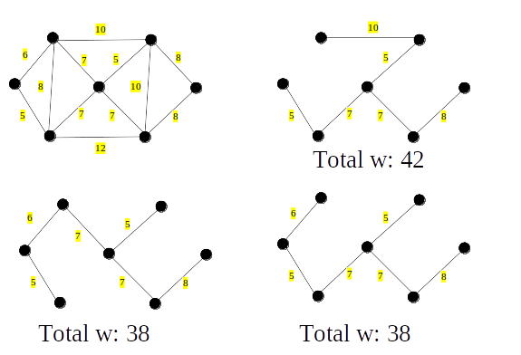
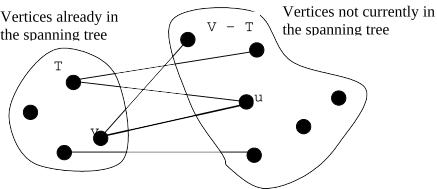
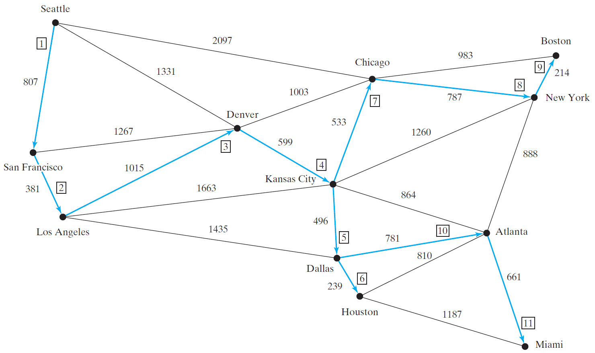
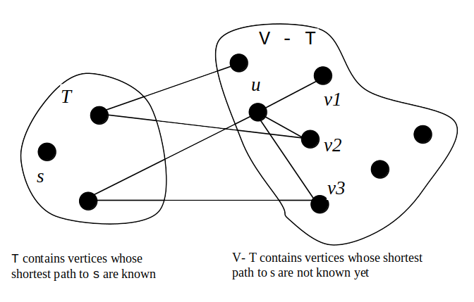
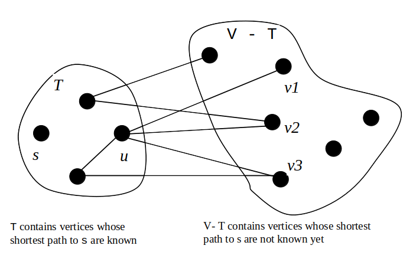
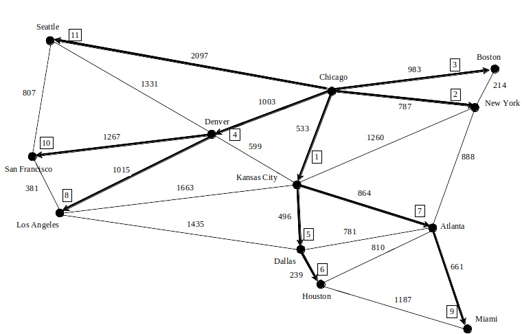

# Weighted Graphs and Applications


Objectives
---
- represent weighted edges using 
  - adjacency matrices 
  - adjacency lists
- design and implement class
  - *WeightedGraph*  that extends *AbstractGraph* 
  - *MST* that extends *Tree*
  - *ShortestPathTree* that extends *SearchTree*
- design, implement and analyze algorithms for finding
  -  a minimum spanning tree (MST)
  - single-source shortest paths
- solve the weighted nine tail problem using the shortest-path algorithm


Explore 🔎 Weighted Graph Animation
---
- [Liang animation](https://liveexample.pearsoncmg.com/liang/animation/animation.html)


Representing Weighted Graphs 
---
- Representing Weighted Edges: Edge Array 
  - a [weighted edge](./demos/WeightedEdge.java): $(u, v, weight)$
  - $E=\{(v_1, v_3, w_{(1,3)}), (v_1, v_9, w_{(1,9)}), \cdots, (v_i, v_j, w_{(i,j)})\}$
  ```java
  int[][] edges = {{1,3,w1_3}, {1,9,w1_9}, ..., {i, j, wi_j}};
  ```
- Weighted Adjacency Matrices 
  ```java
  Integer[][] adjacencyMatrix = {
    {null, 1, 3},
    {-9, null, 0},
    {7, 10, 5}
  }
  ```
- Adjacency List of weighted edges
  ```java
  // 1. array of list of edges for each node
  List<WeightedEdge>[] neighbors = new List[edgeNumber];
  neighbors[0]=new ArrayList<WeightedEdge>(); neighbors[1]=new ArrayList<WeightedEdge>();
  neighbors[1].add(new WeightedEdge(1,3,2.5));
  neighbors[1].add(new WeightedEdge(1,9,7.8));
  // 2. list of list of edges for each node
  List<List<WeightedEdge>> list = new ArrayList<>();
  ```

Design and test class WeightedGraph
---
- extends UnweightedGraph\<V\>
- [WeightedEdge.java](./demos/WeightedEdge.java)
- [TestWeightedGraph.java](./demos/TestWeightedGraph.java)


Minimum Spanning Trees (MST)
---
- A connected graph may have many spanning trees 
- A MST is a spanning tree with the minimum total weights
- 


Find MST with Prim's algorithm
---
```java
Input: G = (V, E) with non-negative weights. 
Output: a MST
MST minimumSpanningTree() {
  Let V denote the set of vertices in the graph;
  Let T be a set for the vertices in the spanning tree;
  Initially, add the starting vertex to T;
  while (size of T < n) {
    find v in T and u in V – T with the smallest weight 
      on the edge (u, v), as shown in the figure;
    add u to T;
  }
}
```
- 


Practice 📝 
---
- run [Prim's algorithm](https://www.cs.usfca.edu/~galles/visualization/Prim.html)


Refine Prim's algorithm
---
```java
Input: a graph G = (V, E) with non-negative weights
Output: a minimum spanning tree with the starting vertex s as the root
MST getMinimumSpanngingTree(s) {
  Let T be a set that contains the vertices in the spanning tree; 
  Initially T is empty;
  Set cost[s] = 0; and cost[v] = infinity for all other vertices in V;
    
  while (size of T < n) {
    Find u not in T with the smallest cost[u];
    Add u to T;
    for (each v not in T and (u, v) in E) 
      if (cost[v] > w(u, v)) {
        cost[v] = w(u, v); parent[v] = u;
     }
  }
}
```
- time complexity: $O(n^3)$
  - can be improved to $O(n^2)$


Implementing MST Algorithm
---
- WeightedGraph\<V\>.MST extends UnweightedGraph\<V\>.SearchTree
- 
- [TestMinimumSpanningTree.java](./demos/TestMinimumSpanningTree.java)


Dijkstra’s Algorithm for Single-Source Shortest Path (SSSP)
---
```java
Input: a graph G = (V, E) with non-negative weights
Output: a shortest path tree with the source vertex s as the root
ShortestPathTree getShortestPath(s) {
  Let T be a set that contains the vertices whose 
    paths to s are known; Initially T is empty;
  Set cost[s] = 0; and cost[v] = infinity for all other vertices in V;
    
  while (size of T < n) {
    Find u not in T with the smallest cost[u];
    Add u to T;
    for (each v not in T and (u, v) in E) 
      if (cost[v] > cost[u] + w(u, v)) {
        cost[v] = cost[u] + w(u, v); parent[v] = u;
      }
  }
}
```
- illustration

| Before moving u to T | After moving u to T |
| --- | --- |
|  |  |


Practice 📝 
---
- run [Dijkstra’s algorithm](https://www.cs.usfca.edu/~galles/visualization/Dijkstra.html)


SSSP Algorithm Implementation
---
- *ShortestPathTree* extends *SearchTree*
- [TestShortestPath.java](./demos/TestShortestPath.java)
- 
- time complexity: $O(n^3)$
  - can be improved to $O(n^2)$


Practice 📝 Solve the Weighted Nine Tail Problem
---
- the number of the flips as the weight on each move
- [WeightedNineTail.java](./demos/WeightedNineTail.java)
  - [WeightedNineTailModel.java](./demos/WeightedNineTailModel.java)


# Online resources
- [visualgo](https://visualgo.net/)
- [Liang animation](https://liveexample.pearsoncmg.com/liang/animation/animation.html)