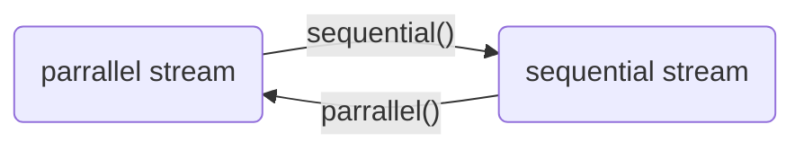

# Aggregate Operations for Collection Streams
chapter 30


Objectives
---
- simplify coding and improve performance using
  - aggregate operations on
    - stream pipelines
    - parallel streams
- common operations on streams
  - lazy intermediate methods 
    - skip, limit, filter, distinct, sorted, map, and mapToInt
  - terminal methods 
    - count, sum, average, max, min, forEach, findFirst, firstAny, anyMatch, allMatch, noneMatch, and toArray
  - reduce the elements into a single result using method
    - reduce 
  - place the elements into a mutable collection using  method
    - collect
  - group the elements then apply method
    - aggreate in the groups
- process primitive data values using 
  - IntStream, LongStream, and DoubleStream


[Stream](https://devdocs.io/openjdk~17/java.base/java/util/stream/stream)
---
- a sequence of elements
- aggregate operations applied on stream
  - filter and count
- An intermediate method 
  - transfroms a stream into another stream
- An terminal method performs 
  - an action and terminates a stream
- A static method 
  - creates a stream


Stream Pipeline
---
- consists of 
  - a stream created from a data source 
  - zero or more intermediate methods
  - a final terminal method
    ```java
    set.stream().limit(50).distinct().count();
    ```
- Streams are lazy
  - computation is performed only when the terminal operation is initiated
  - allows the JVM to optimize computation


Practice 📝 
---
- [StreamDemo.java](./demos/StreamDemo.java)


Functional Interface Arguments 
---
- Most of the arguments for stream methods are 
  - instances of functional interfaces 
  - the arguments can be created using 
    - *lambda expressions* or *method references*
    - anonymous inner class of interface 
      - [Consumer](https://devdocs.io/openjdk~17/java.base/java/util/function/consumer) for method *forEach*
      - [Comparator](https://devdocs.io/openjdk~17/java.base/java/util/comparator) for method *sorted*
      - [Predicate](https://devdocs.io/openjdk~17/java.base/java/util/function/predicate) for method *filter*
      - [Function](https://devdocs.io/openjdk~17/java.base/java/util/function/function) for method *map*

```java
// A: forEach 
// 1. lambda expression
forEach(e->System.out.println(e));
// 2. anonymous inner class
forEach(
  new java.util.function.Consumer<String>(){
    @override
    public void accept(String e){ System.out.println(e); }
  }
)

// B: sorted 
// 1. sorted() is to sort the elements in their natural order
// 2. sorted(Comparator) sorts using the specified comparator
// 2.1 lambda expression
sorted((e1, e2)->e1.compareToIgnoreCase(e2))
// 2.2 method reference
sorted(String::compareToIgnoreCase);
// 2.3 anonymous inner class
sorted(
  new java.util.Comparator<String>(){
    @override
    public int compare(String e1, String e2){
      return e1.compareToIgnoreCase(e2);
    }
  }
)

// C: filter
// selects the elements that satisfies the predicate
// 1. lambda expression
filter(e->e.length() > 4);
// 2. anonymous inner class
filter(
  new java.util.function.Predicate<String>(){
    @override
    public boolean test(String e){
      return e.length() > 4;
    }
  }
)

// D: max, min
// take an argument of  Comparator<? Super T> 

// E: anyMatch, allMatch, noneMatch 
// take an argument of  Predicate<? super T>

// F: map
// takes an argument of type Function<? super T, ? super R>  
// returns an instance of the Stream<R>
// The Function is a functional interface with 
//  an abstract method apply(T t) that maps T -> R
// 1. lambda expression
map(e->e.toUpperCase())
// 2. method reference
map(String::toUpperCase)
// 3. anonymous inner class
map(
  new java.util.function.Function<String, String>(){
    @override
    public String apply(String e){
      return e.toUpperCase();
    }
  }
)
```


IntStream, LongStream, and [DoubleStream](https://devdocs.io/openjdk~17/java.base/java/util/stream/doublestream)
---
- Stream represents sequence of objects
- IntStream, LongStream, and DoubleStream  
  - represent sequence of int, long, and double values
  - subinterfaces of BaseStream 
  - *sum(), average(), summaryStatistics()* 
    - return the sum, average, various statistics of the elements 
  - *mapToInt* 
    - convert a Stream to an IntStream 
  - *map* 
    - convert any stream to a Stream
- [IntStreamDemo.java](./demos/IntStreamDemo.java)


Parallel Streams
---
- returned by *parallelStream()* to execute operations in parallel
- *stream()* method returns a sequential stream


- [ParallelStreamDemo.java](./demos/ParallelStreamDemo.java)


Stream Reduction Using the reduce Method
---
- make code concise and parallelizable
  ```java
  // without reduce
  int total = 0;
  for(int e: set){ total += e;}
  // with reduce
  int sum = set.parallelStream().reduce(0, (e1,e2)->e1+e2);
  ```
- [StreamReductionDemo.java](./demos/StreamReductionDemo.java)


Stream Reduction Using the collect Method
---
- reduce the elements in a stream into a mutable container
  ```java
  // 1. string concatenation with reduce is very inefficient
  // due to that a new string is created for each concatenation
  String sentence = words.parallelStream().reduce("", (s1,s2)->s1+s2);
  // 2. efficient way
  // use a StringBuilder and accumulate the result into a StringBuilder 
  // This can be accomplished using the collect method
  ```
- [CollectDemo.java](./demos/CollectDemo.java)


Grouping Elements Using the [Collectors.groupingBy](https://devdocs.io/openjdk~17/java.base/java/util/stream/collectors)
---
- use  *groupingBy* then *collect* to collect the elements by groups
- [CollectGroupDemo.java](./demos/CollectGroupDemo.java)


Practice 📝 
---
- use stream to
  - [analyze numbers](./demos/AnalyzeNumbersUsingStream.java)
  - [count the occurrences of each letter](./demos/CountLettersUsingStream.java)
  - [count the occurrences of each letter in a string](./demos/CountOccurrenceOfLettersInAString.java)
  - [process all elements in a two-dimensional array](./demos/TwoDimensionalArrayStream.java)
  - [finding the directory size](./demos/DirectorySizeStream.java)
  - [count keywords](./demos/CountKeywordStream.java)
  - [count occurrences of words](./demos/CountOccurrenceOfWordsStream.java)

# Online resources
- [visualgo](https://visualgo.net/)
- [Liang animation](https://liveexample.pearsoncmg.com/liang/animation/animation.html)
- [JDK 17 documentation](https://devdocs.io/openjdk~17)
  - [Package java.util.stream](https://devdocs.io/openjdk~17/java.base/java/util/stream/package-summary)